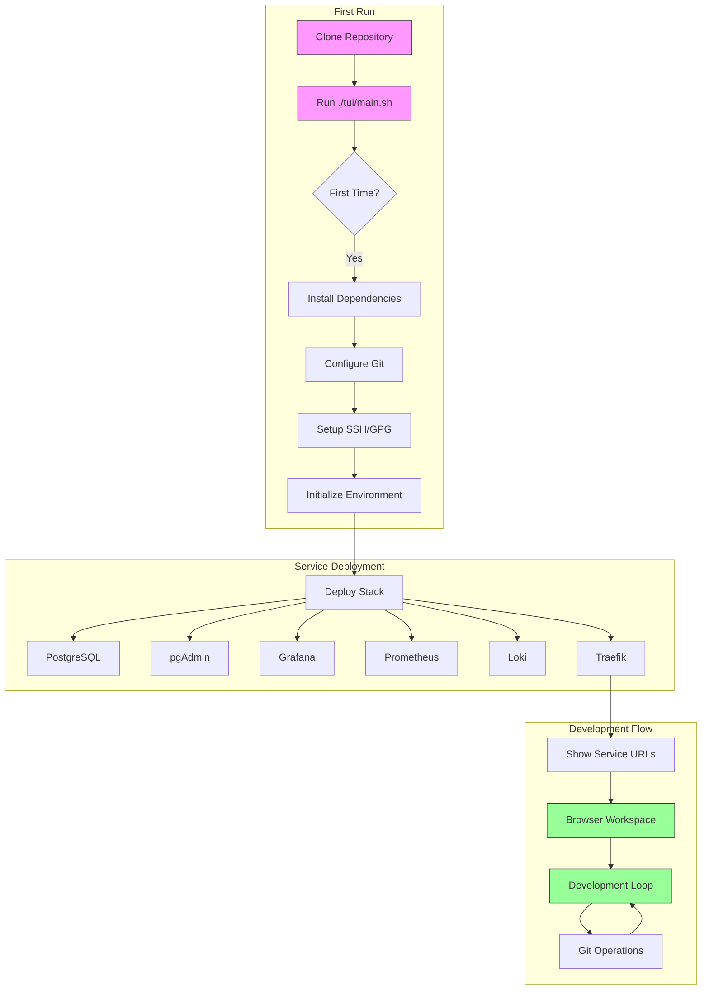
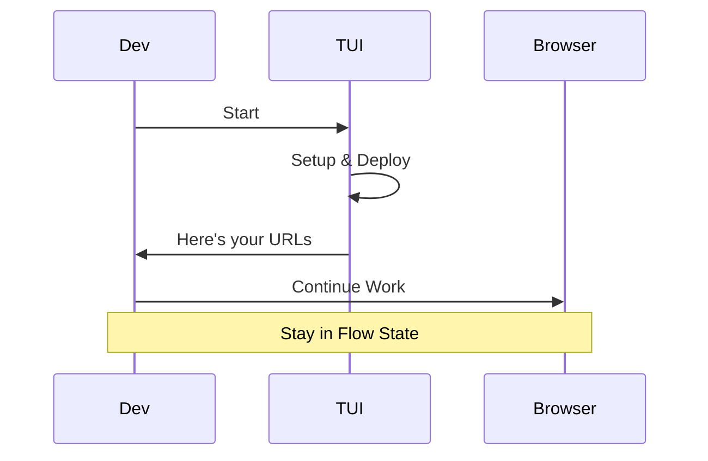
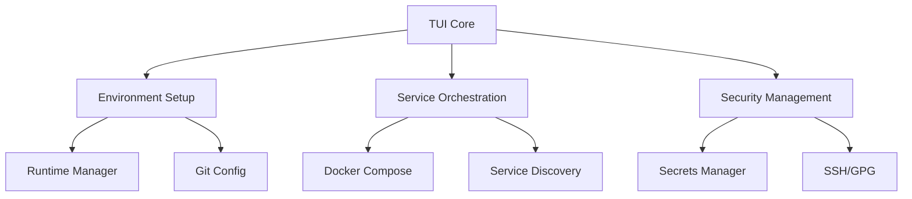
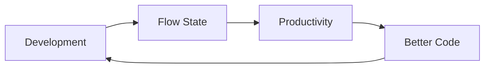

# DevOps TUI: From Zero to Flow in One Command

A development environment orchestrator that eliminates setup friction and gets you into flow state faster. Stop memorizing commands, managing services, or hunting down endpoints - just code.

## The Vision


## Quick Start
```bash
# Clone and start
git clone https://github.com/yourusername/devops-tui.git
cd devops-tui
./tui/main.sh

# That's it. Really.
```

## Complete Workflow



## What It Does

### 1. First Run Magic
- Detects missing tools and installs them
- Sets up Git, SSH, GPG automatically
- Configures runtime environments
- Creates secure credentials

### 2. Environment Orchestration
- Deploys complete development stack
- Manages service dependencies
- Handles port configurations
- Sets up secure networking

### 3. Instant Workspace
All your tools, ready to go:
- PostgreSQL for data
- pgAdmin for database management
- Grafana for visualization
- Prometheus for metrics
- Loki for logs
- Traefik for routing

### 4. Then Gets Out of Your Way


## Philosophy

### The Problem
Traditional development setup:
1. ❌ Remember dozen of commands
2. ❌ Configure multiple services
3. ❌ Manage dependencies
4. ❌ Track ports and endpoints
5. ❌ Switch context constantly

### Our Solution
Flow-focused development:
1. ✅ One command to rule them all
2. ✅ Automatic service orchestration
3. ✅ Environment parity guaranteed
4. ✅ Clear handoff to browser tools
5. ✅ Stay in your creative flow

## Core Features

### Environment Management
- **Runtime Versions**: Automatic management of Node.js, Python, Ruby, Go
- **Database Setup**: PostgreSQL with automatic configuration
- **Service Orchestration**: Docker-based service management
- **Security**: Automated credential and secret management

### Development Tools
- **Database**: PostgreSQL + pgAdmin
- **Monitoring**: Grafana + Prometheus
- **Logging**: Loki
- **Routing**: Traefik

### Workflow Integration
- **Git Flow**: Branch management and remote setup
- **CI/CD**: GitHub Actions integration
- **Docker**: Container orchestration
- **Security**: SSH and GPG key management

## Service URLs

After deployment, everything is available at predictable URLs:
- Database: pgAdmin at http://pgadmin.localhost
- Metrics: Grafana at http://grafana.localhost
- Monitoring: Prometheus at http://prometheus.localhost
- Logs: Loki at http://loki.localhost
- Routing: Traefik at http://localhost:8080

## Development

### Prerequisites
- Bash 4.0+
- Git
- Docker (installed automatically if missing)

### Contributing
1. Fork the repository
2. Create feature branch
3. Commit changes
4. Push to branch
5. Create Pull Request

### Testing
```bash
# Run all tests
./tests/run_all.sh

# Run specific component tests
./tests/components/test_*.sh
```

## Architecture

### System Architecture


### Flow Philosophy


## License
MIT License - see LICENSE file for details.

## Support
- Issues: GitHub Issues
- Docs: /docs directory
- Wiki: GitHub Wiki

Remember: The goal isn't to provide every feature - it's to get you into flow state as fast as possible, then get out of your way.
