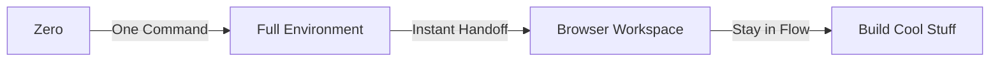
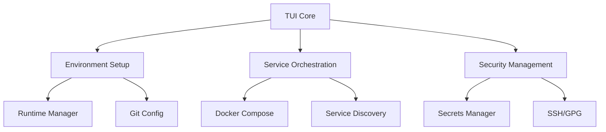
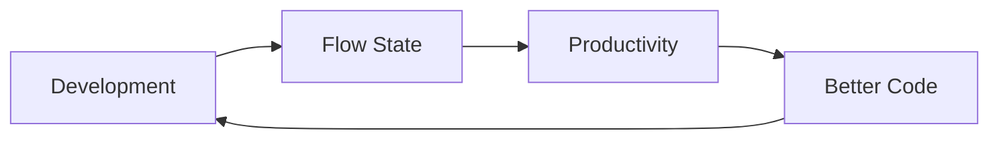

# DevOps TUI: From Zero to Flow in One Command

A development environment orchestrator that eliminates setup friction and gets you into flow state faster. Stop memorizing commands, managing services, or hunting down endpoints - just code.

## The Vision



## Quick Start
```bash
# Clone and start
git clone https://github.com/yourusername/devops-tui.git
cd devops-tui
./tui/main.sh

# That's it. Really.
```

## What The TUI Does

The TUI (Terminal User Interface) is your command center for development operations:

### 1. Environment Setup
- Detects and installs missing tools automatically
- Sets up development runtime (Node.js, Python, Ruby, Go)
- Configures local databases and services
- Manages Docker containers and networking

### 2. Service Management
- One-click deployment of your development stack
- Automatic port configuration and service discovery
- Health monitoring and status dashboards
- Log aggregation and viewing

### 3. Repository Management
- Configures GitHub repository settings and templates
- Sets up CI/CD pipelines and workflows
- Manages security scanning and enforcement
- Handles code quality tools and checks

### 4. Development Workflow
- Manages Git operations and branching
- Handles database migrations and backups
- Provides quick access to logs and metrics
- Automates common development tasks

### 5. Security & Credentials
- Manages SSH and GPG keys
- Handles secrets and environment variables
- Configures secure access to services
- Sets up authentication for tools

The TUI provides a simple menu-driven interface to all these features, eliminating the need to remember commands or manage configurations manually.

## Core Features

### Environment Management
- **Runtime Versions**: Automatic management of Node.js, Python, Ruby, Go
- **Database Setup**: PostgreSQL with automatic configuration
- **Service Orchestration**: Docker-based service management
- **Security**: Automated credential and secret management

### Development Tools
- **Database**: PostgreSQL + pgAdmin
- **Monitoring**: Grafana + Prometheus
- **Logging**: Loki
- **Routing**: Traefik

### Repository Automation
The TUI includes comprehensive repository automation features. See:
- [Repository Automation Guide](docs/concepts/recipes/repository_automation.md)
- [Implementation Guide](docs/concepts/recipes/implementation_guide.md)
- [Automation Roadmap](docs/concepts/recipes/automation_roadmap.md)

Key automation features:
- Automated repository setup and configuration
- Template management (Issues, PRs, Discussions)
- GitHub Actions workflow automation
- Security scanning and enforcement
- Development standards automation

### Workflow Integration
- **Git Flow**: Branch management and remote setup
- **CI/CD**: GitHub Actions integration
- **Docker**: Container orchestration
- **Security**: SSH and GPG key management

## Service URLs

After deployment, everything is available at predictable URLs:
- Database: pgAdmin at http://pgadmin.localhost
- Metrics: Grafana at http://grafana.localhost
- Monitoring: Prometheus at http://prometheus.localhost
- Logs: Loki at http://loki.localhost
- Routing: Traefik at http://localhost:8080

## Development

### Prerequisites
- Bash 4.0+
- Git
- Docker (installed automatically if missing)

### Contributing
1. Fork the repository
2. Create feature branch
3. Commit changes
4. Push to branch
5. Create Pull Request

### Testing
```bash
# Run all tests
./tests/run_all.sh

# Run specific component tests
./tests/components/test_*.sh
```

## Architecture

### System Architecture


### Flow Philosophy


## Documentation
- [Architecture Guide](docs/concepts/architecture_guide.md)
- [Practical Guide](docs/concepts/practical_guide.md)
- [Recipes & Patterns](docs/concepts/recipes/)
- [Component Documentation](docs/components/)

## License
MIT License - see LICENSE file for details.

## Support
- Issues: GitHub Issues
- Docs: /docs directory
- Wiki: GitHub Wiki

Remember: The goal isn't to provide every feature - it's to get you into flow state as fast as possible, then get out of your way.
