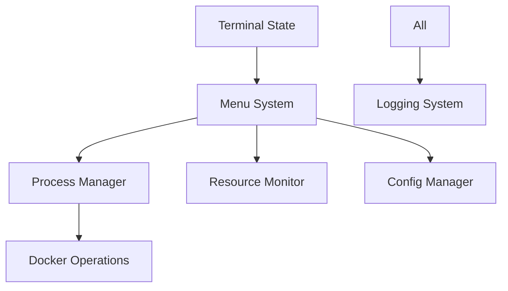

# DevOps TUI Framework

A robust Terminal User Interface (TUI) framework for DevOps operations, built in pure Bash. This framework provides a comprehensive solution for building reliable, state-aware terminal applications with proper process management and error recovery.

## Core Architecture

The framework is built around several key components that work together to provide a reliable and maintainable TUI system:



### Key Components

1. **Terminal State Management**
   - Robust terminal state tracking
   - State restoration on errors
   - Clean terminal handling
   - Session persistence

2. **Process Management**
   - Reliable process lifecycle handling
   - Resource cleanup
   - Zombie process prevention
   - Signal handling

3. **Menu System**
   - State-aware menu navigation
   - Consistent UI patterns
   - Error recovery
   - User feedback

4. **Docker Operations**
   - Container lifecycle management
   - Health monitoring
   - Network management
   - Resource tracking

5. **Resource Monitoring**
   - System resource tracking
   - Container resource usage
   - Alert thresholds
   - Usage history

6. **Configuration Management**
   - Config file handling
   - Validation
   - Auto-backup
   - Version tracking

7. **Logging System**
   - Structured logging
   - Rotation handling
   - Error tracking
   - Audit trail

## Project Structure

```
.
├── tui/
│   ├── components/
│   │   ├── terminal_state.sh    # Terminal state management
│   │   ├── process_manager.sh   # Process lifecycle handling
│   │   ├── menu_state.sh       # Menu state tracking
│   │   ├── menu_system.sh      # Menu UI components
│   │   ├── docker_operations.sh # Docker management
│   │   ├── logging_system.sh   # Logging functionality
│   │   ├── config_manager.sh   # Configuration handling
│   │   └── resource_monitor.sh # Resource tracking
│   ├── main.sh                 # Main application entry
│   └── theme.sh               # UI theming
└── docs/
    ├── architecture.md        # System architecture
    ├── interactions.md        # Component interactions
    ├── error_scenarios.md     # Error handling
    └── components/            # Component documentation
```

## Features

### Core Functionality
- Robust state management
- Process lifecycle handling
- Error recovery
- Resource monitoring
- Configuration management
- Structured logging

### UI Components
- State-aware menus
- Progress tracking
- Status updates
- Error dialogs
- Configuration forms

### Docker Integration
- Container management
- Health monitoring
- Network configuration
- Resource tracking

### System Monitoring
- Resource usage tracking
- Alert thresholds
- Usage history
- Performance metrics

## Requirements

- Bash 4.0+
- Docker
- Standard Unix utilities

## Installation

1. Clone the repository:
```bash
git clone https://github.com/yourusername/devops-tui.git
```

2. Install dependencies:
```bash
# For macOS
brew install docker

# For Ubuntu/Debian
sudo apt-get install docker.io

# For CentOS/RHEL
sudo yum install docker
```

3. Source the main script:
```bash
source "path/to/tui/main.sh"
```

## Usage

### Basic Operations
```bash
# Start the TUI
./tui/main.sh

# Run with debug logging
DEBUG=1 ./tui/main.sh

# Run with custom config
CONFIG_PATH=/path/to/config ./tui/main.sh
```

### Configuration
```bash
# Core settings
TERMINAL_STATE_FILE="/tmp/tui_state"
PROCESS_TIMEOUT=30
MAX_RETRY_ATTEMPTS=3

# Docker settings
DOCKER_HEALTH_CHECK_INTERVAL=60
CONTAINER_RESOURCE_LIMITS=true

# Logging settings
LOG_LEVEL="info"
LOG_FILE="/var/log/tui.log"
ENABLE_AUDIT_TRAIL=true
```

## Error Handling

The framework implements comprehensive error handling:

1. **Graceful Degradation**
   - Fallback to simpler UI
   - Memory-only operation
   - Reduced functionality mode

2. **State Recovery**
   - State checkpoints
   - Configuration backups
   - Process recovery

3. **Resource Management**
   - Garbage collection
   - Resource limits
   - Cleanup procedures

## Development

### Running Tests
```bash
# Run all tests
./tests/run_all.sh

# Run component tests
./tests/components/test_terminal_state.sh
./tests/components/test_process_manager.sh
```

### Adding Components
1. Create component file in `tui/components/`
2. Implement state management
3. Add error handling
4. Update documentation
5. Add tests

## Contributing

1. Fork the repository
2. Create feature branch (`git checkout -b feature/name`)
3. Commit changes (`git commit -m 'Add feature'`)
4. Push branch (`git push origin feature/name`)
5. Create Pull Request

## License

MIT License - see LICENSE file for details.

## Documentation

- [Architecture Overview](docs/architecture.md)
- [Component Interactions](docs/interactions.md)
- [Error Scenarios](docs/error_scenarios.md)
- [Component Documentation](docs/components/)
