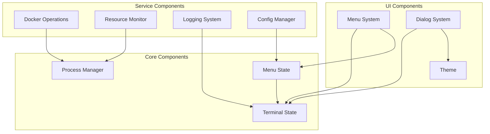
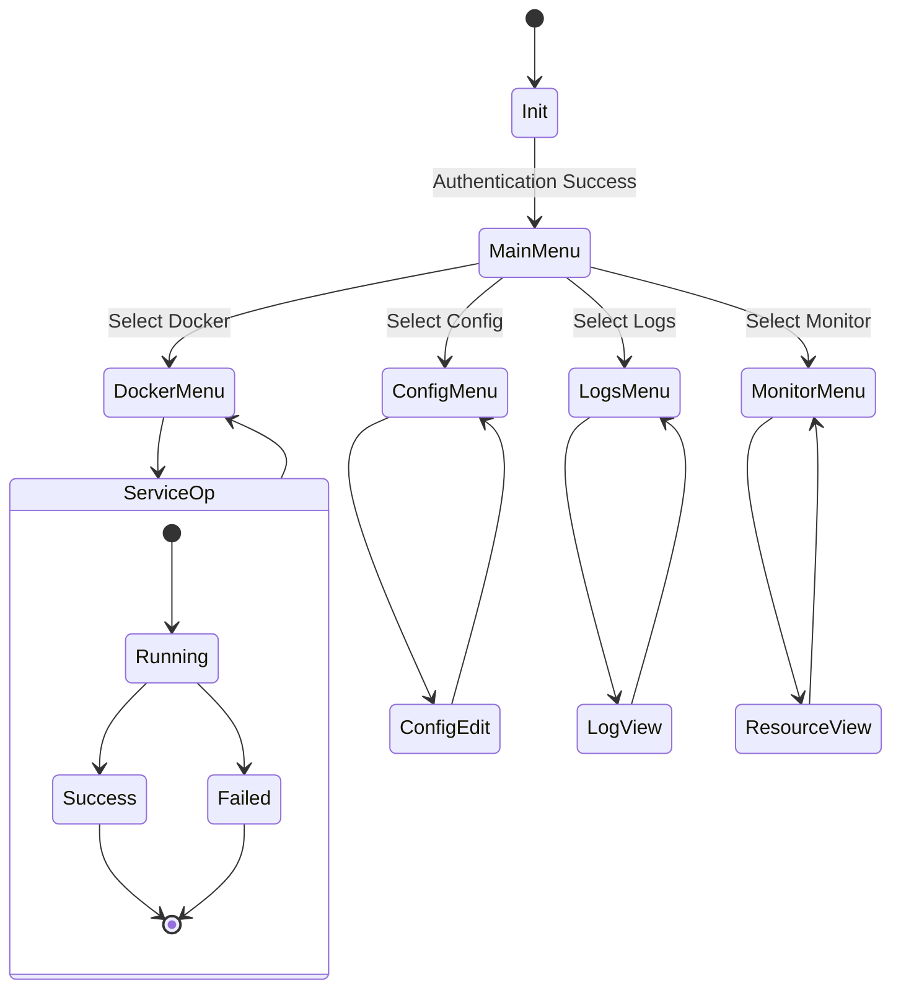
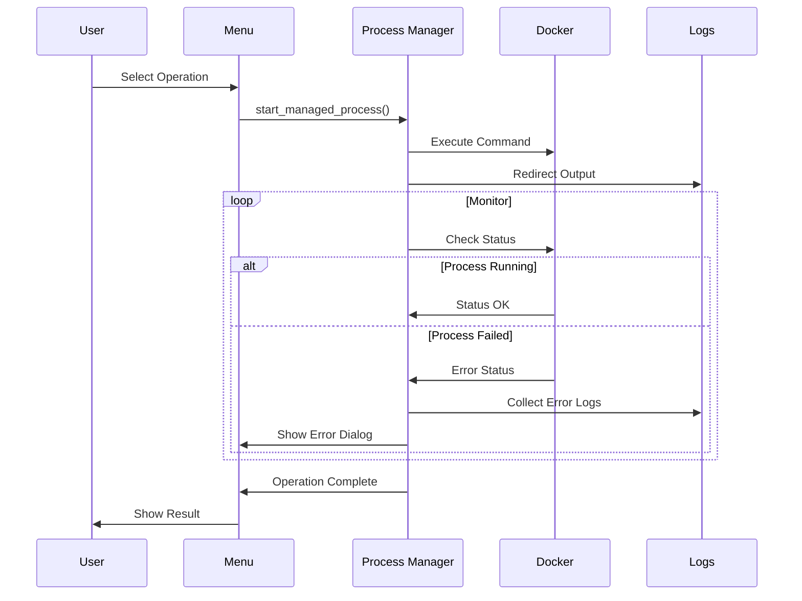
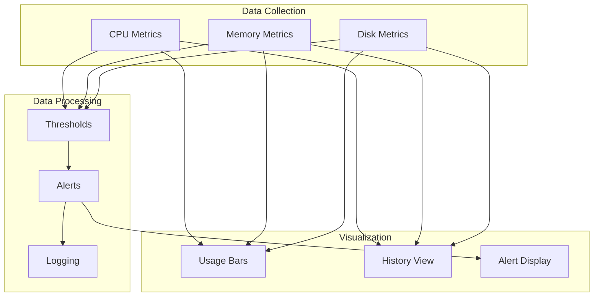
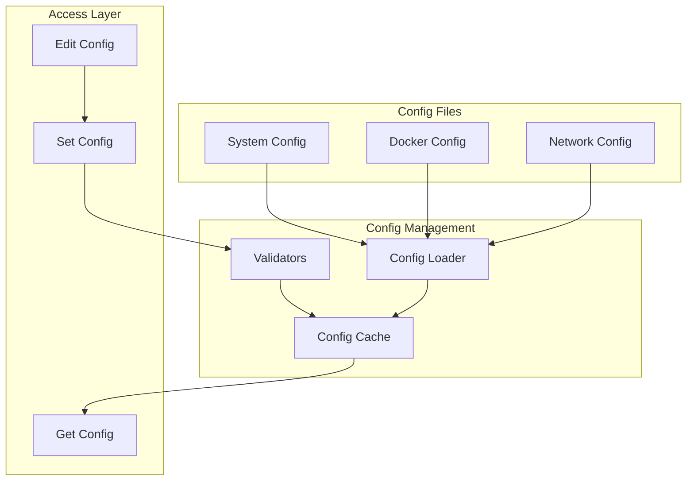

# DevOps TUI Architecture

This document provides a comprehensive overview of the DevOps TUI system architecture.

## System Overview

The system is built with a modular architecture focusing on clean state management and robust process handling.

## State Management

The system uses a hierarchical state management system to maintain clean state transitions and proper cleanup.

## Process Management

The system handles long-running processes with proper monitoring and cleanup.

## Resource Monitoring

The resource monitoring system collects and visualizes system metrics.

## Configuration Management

The configuration system provides validated settings management.

## Component Details

### Terminal State Management
- Handles terminal cleanup and restoration
- Manages screen state stack
- Ensures proper cleanup on exit

### Process Management
- Tracks running processes
- Handles output redirection
- Manages process lifecycle
- Provides cleanup on exit

### Menu System
- Implements hierarchical menus
- Maintains menu state stack
- Handles user input
- Manages screen transitions

### Docker Operations
- Manages Docker services
- Handles service health checks
- Provides service logs
- Manages cleanup

### Resource Monitor
- Collects system metrics
- Processes threshold alerts
- Maintains metric history
- Visualizes resource usage

### Configuration Manager
- Validates configuration
- Manages config persistence
- Provides atomic updates
- Handles defaults

### Logging System
- Manages log rotation
- Provides contextual logging
- Handles log viewing
- Maintains log history 