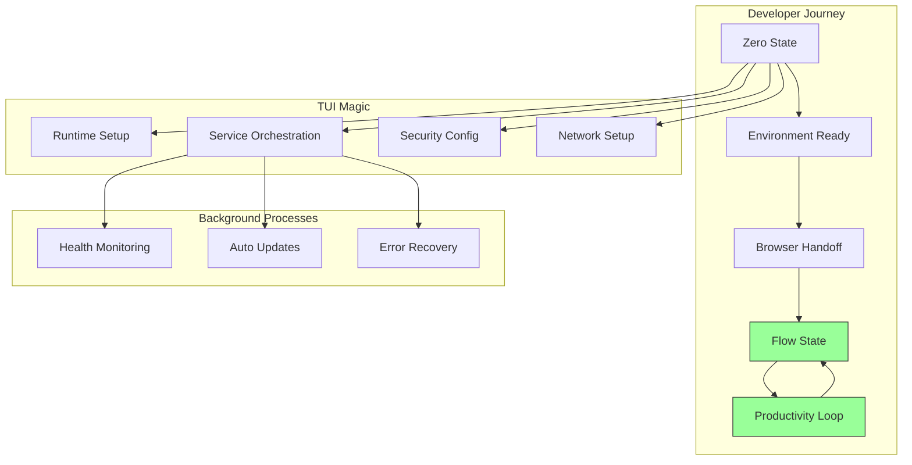
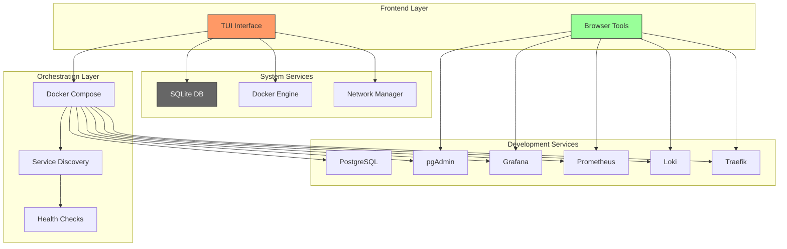
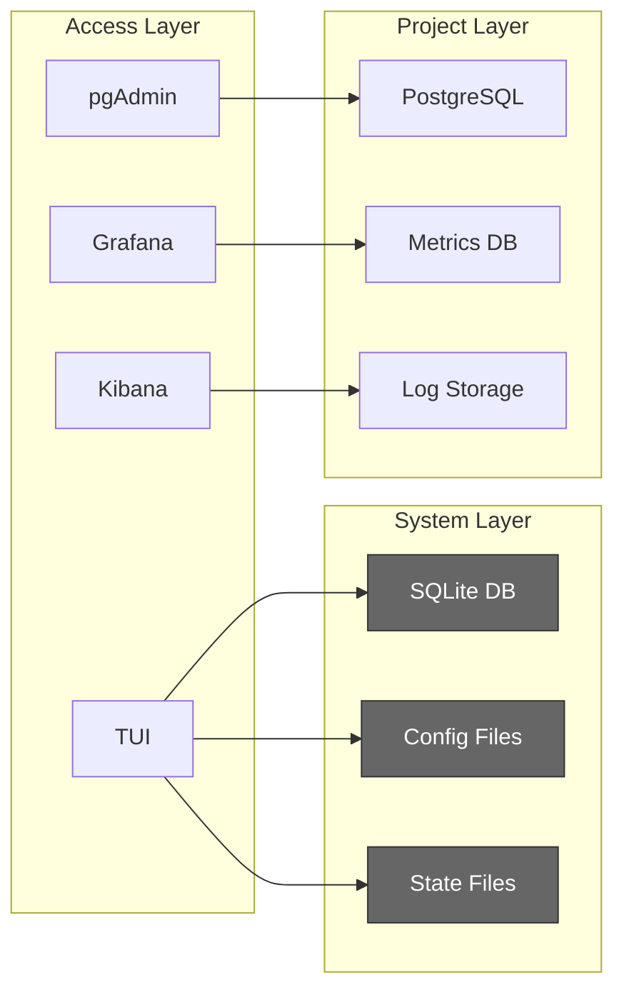
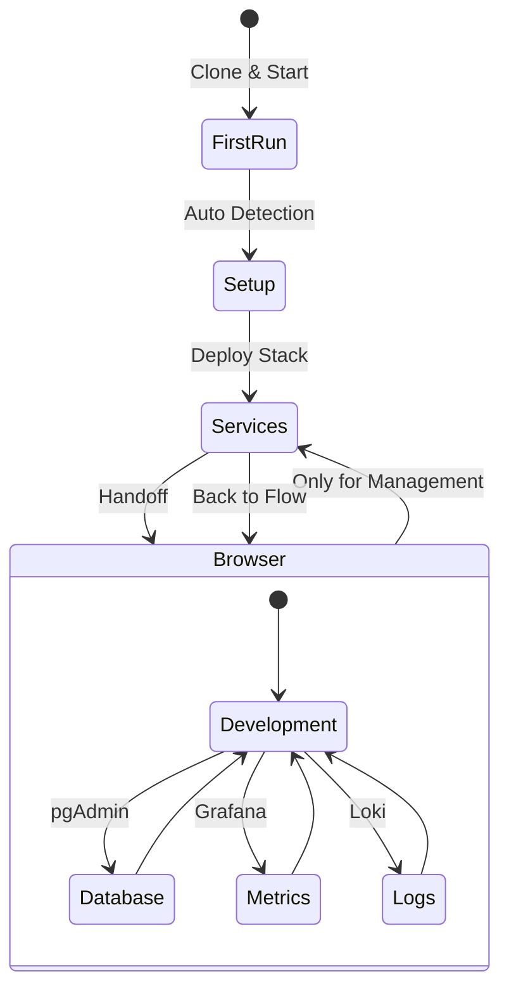
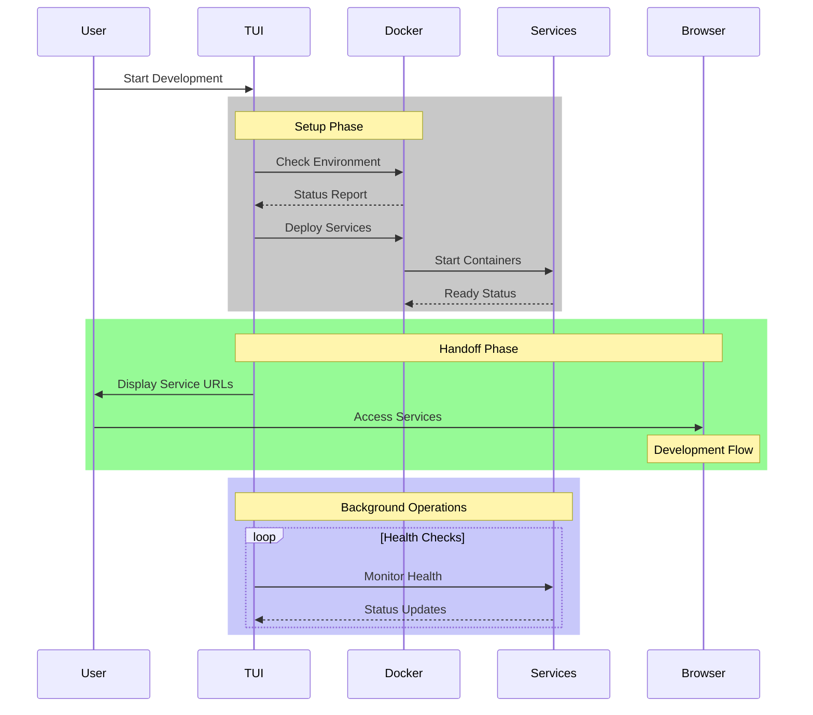
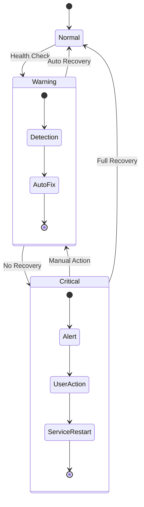
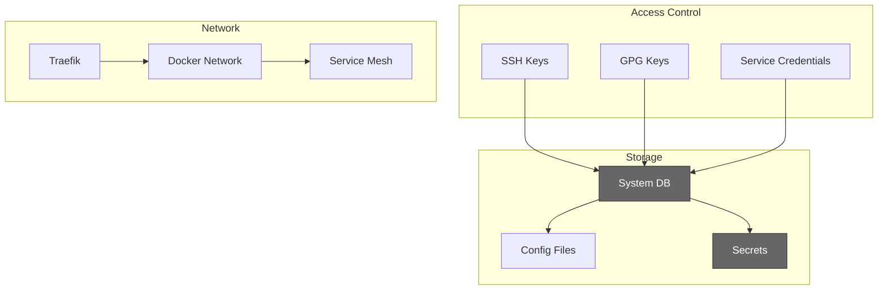
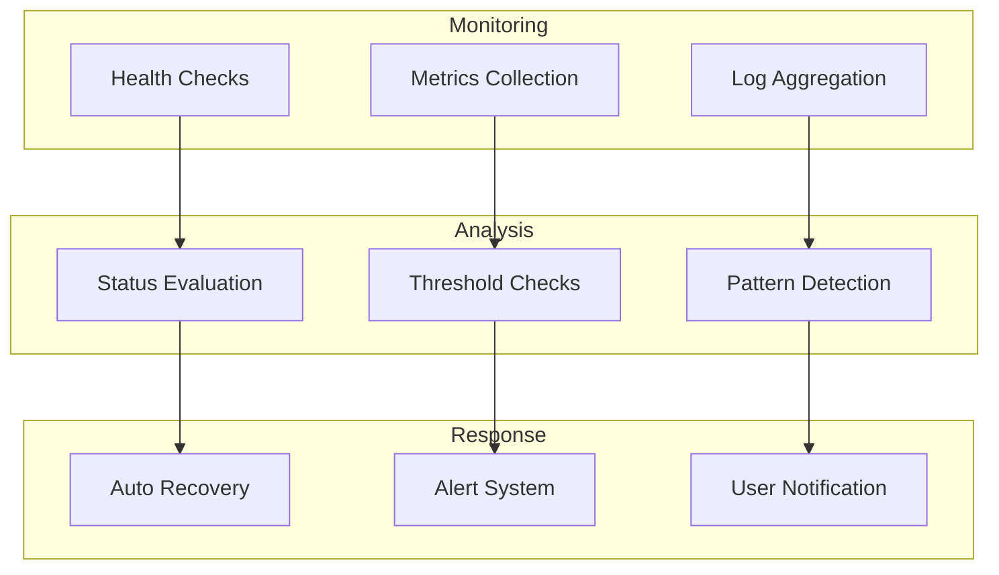

# DevOps TUI Architecture

## Philosophy: Flow State First

The architecture is designed around one core principle: **Get developers into flow state as quickly as possible**.

## Service Architecture

## Data Flow

## Development Workflow

## Component Interaction

## Error Recovery

## Security Model

## Service Health Management

Remember: Every component and interaction is designed to maintain flow state. The system should handle complexity invisibly and only surface what's needed for development.