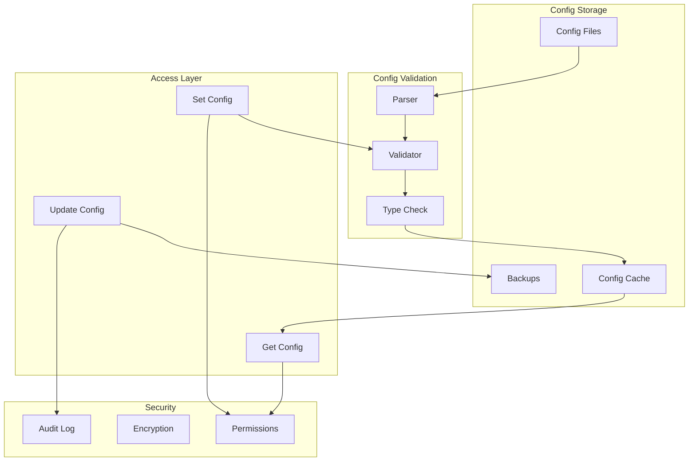
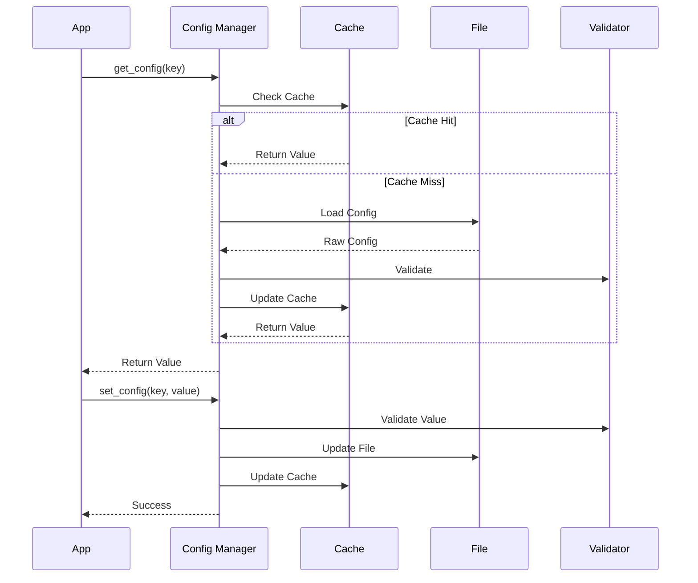
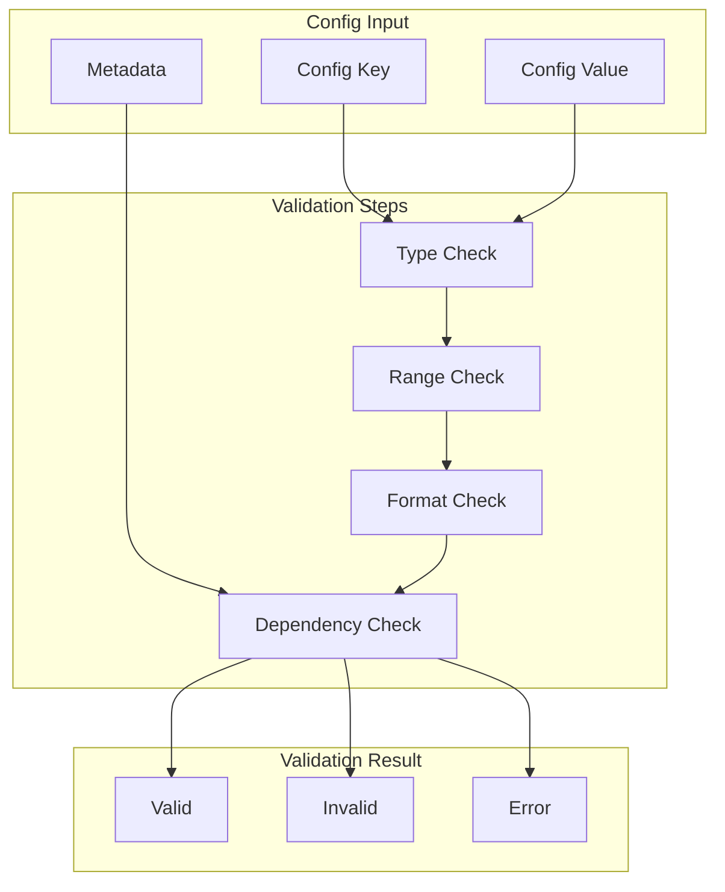
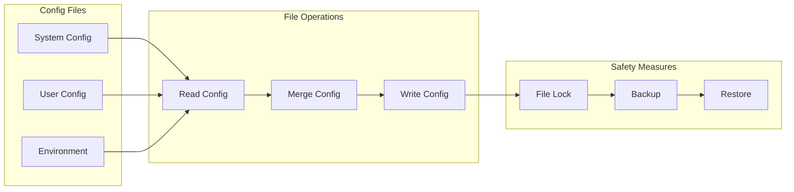
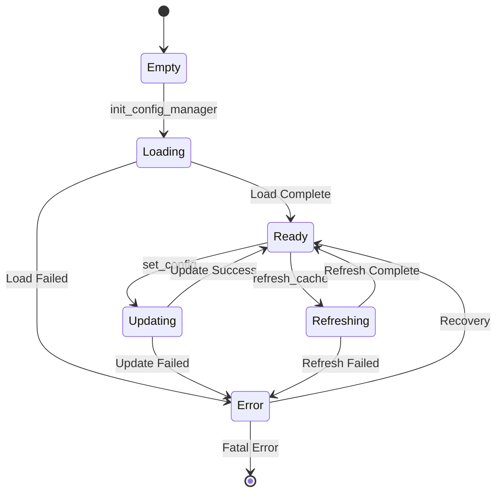
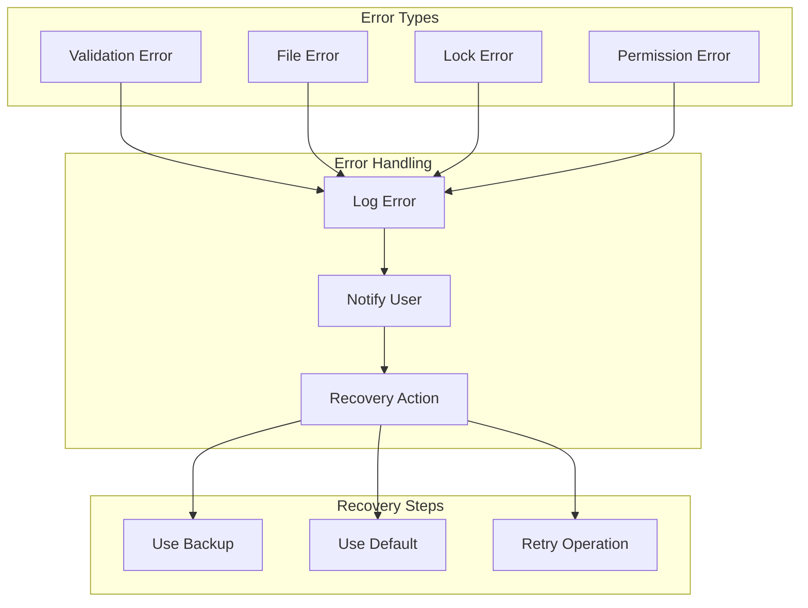

# Configuration Manager

The configuration management system provides robust configuration handling with validation, caching, and atomic updates.

## Configuration Architecture



## Configuration Flow



## Validation System



## File Management



## Cache Management



## Key Features

- Configuration validation
- Atomic updates
- Cache management
- Type safety
- Default values
- Environment overrides
- Change auditing

## Usage Example

```bash
# Initialize config manager
init_config_manager

# Get configuration value
get_config "key" "default_value"

# Set configuration value
set_config "key" "value"

# Show configuration editor
show_config_editor "system"

# Validate configuration
validate_config "key" "value"
```

## Error Handling



## Best Practices

1. Always validate configurations
2. Use atomic updates
3. Implement proper locking
4. Maintain backups
5. Document config options
6. Handle all error cases
7. Use type checking
8. Provide defaults
9. Audit changes 