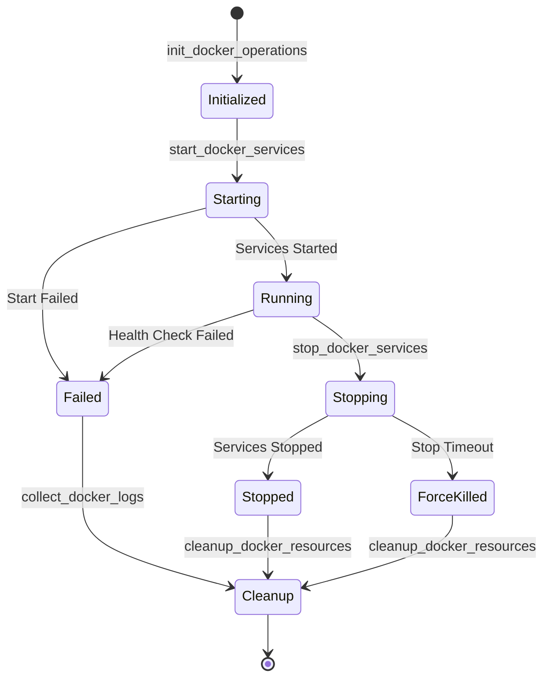
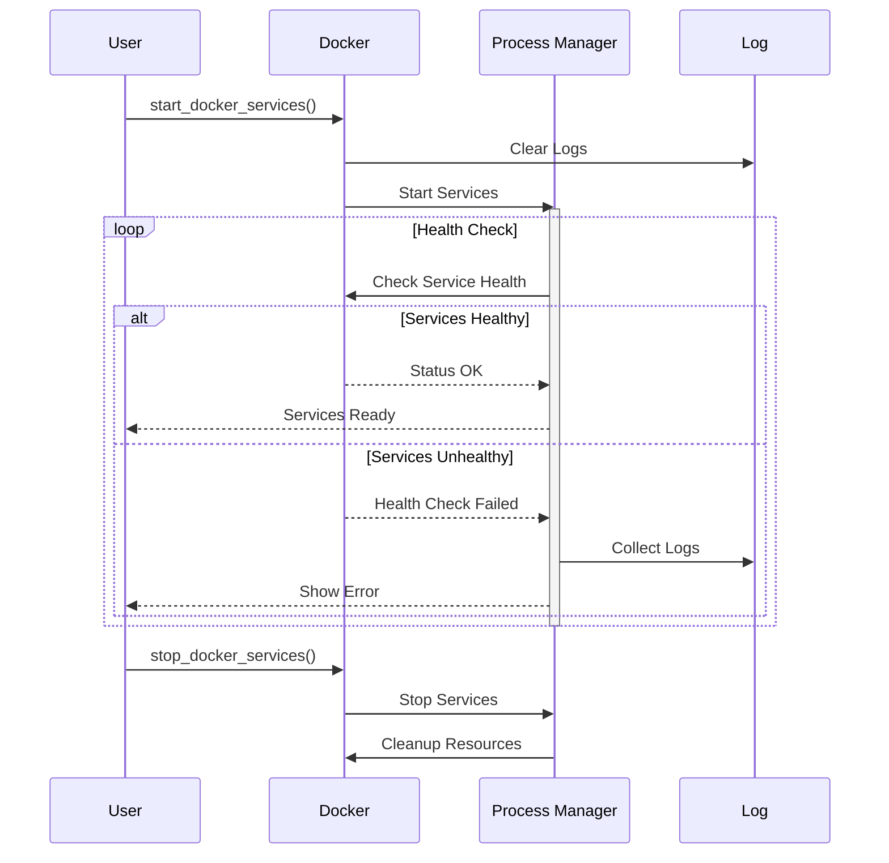
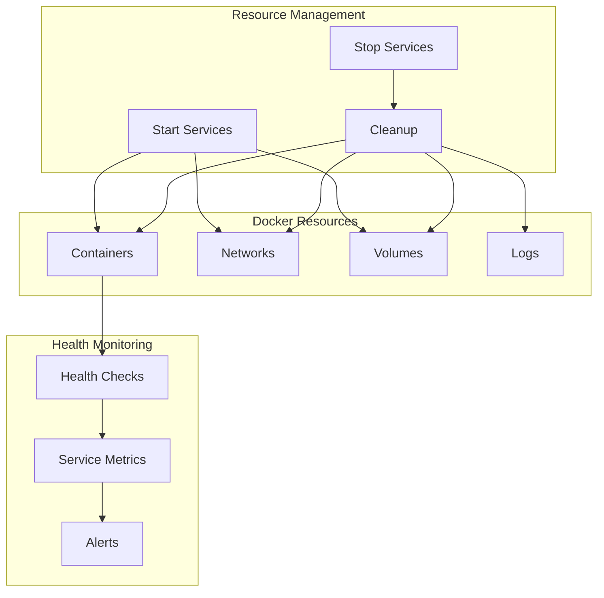
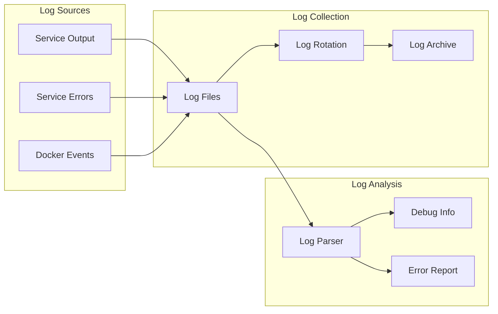
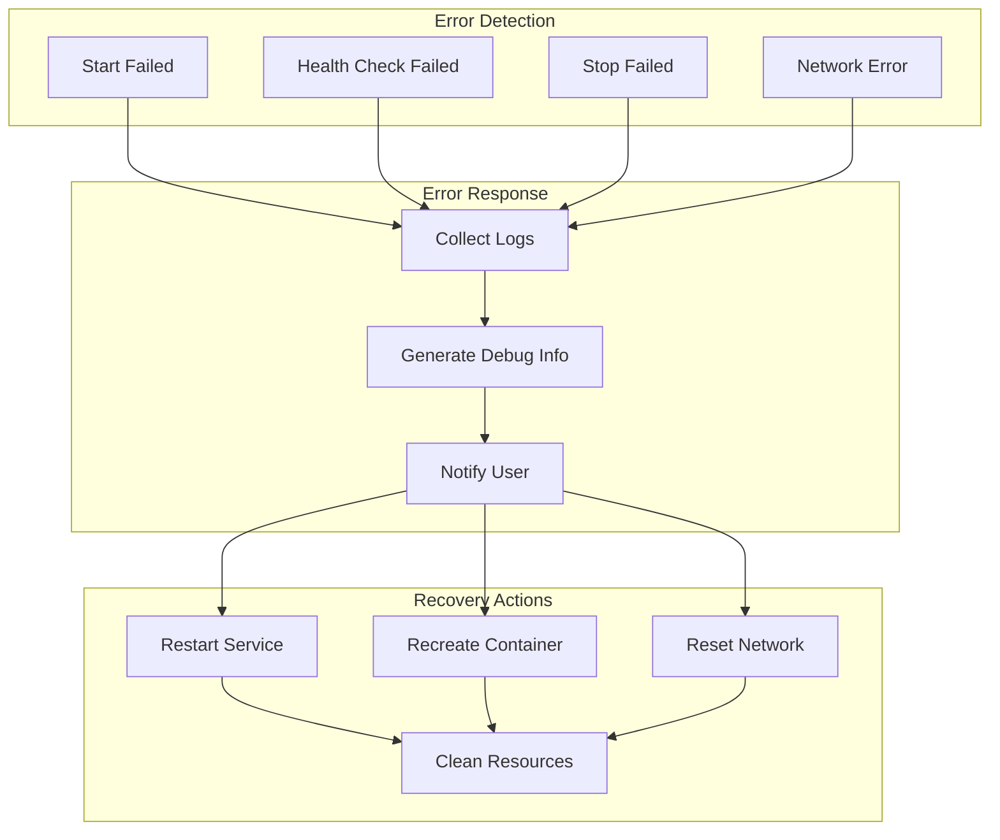

# Docker Operations

The Docker operations system provides robust management of Docker services with proper process handling and monitoring.

## Service Lifecycle



## Service Management Flow



## Resource Management



## Log Management



## Key Features

- Service lifecycle management
- Health monitoring
- Log collection and rotation
- Resource cleanup
- Error recovery
- State tracking

## Usage Example

```bash
# Initialize Docker operations
init_docker_operations

# Start services
start_docker_services "docker-compose.yml"

# Check service status
show_docker_status

# View service logs
show_docker_logs "service_name"

# Stop services
stop_docker_services

# Clean up resources
cleanup_docker_resources
```

## Error Handling Strategy



## Best Practices

1. Always use health checks
2. Implement proper logging
3. Handle cleanup properly
4. Monitor resource usage
5. Set appropriate timeouts
6. Use proper error handling
7. Maintain service state
8. Document configuration
9. Follow security practices 