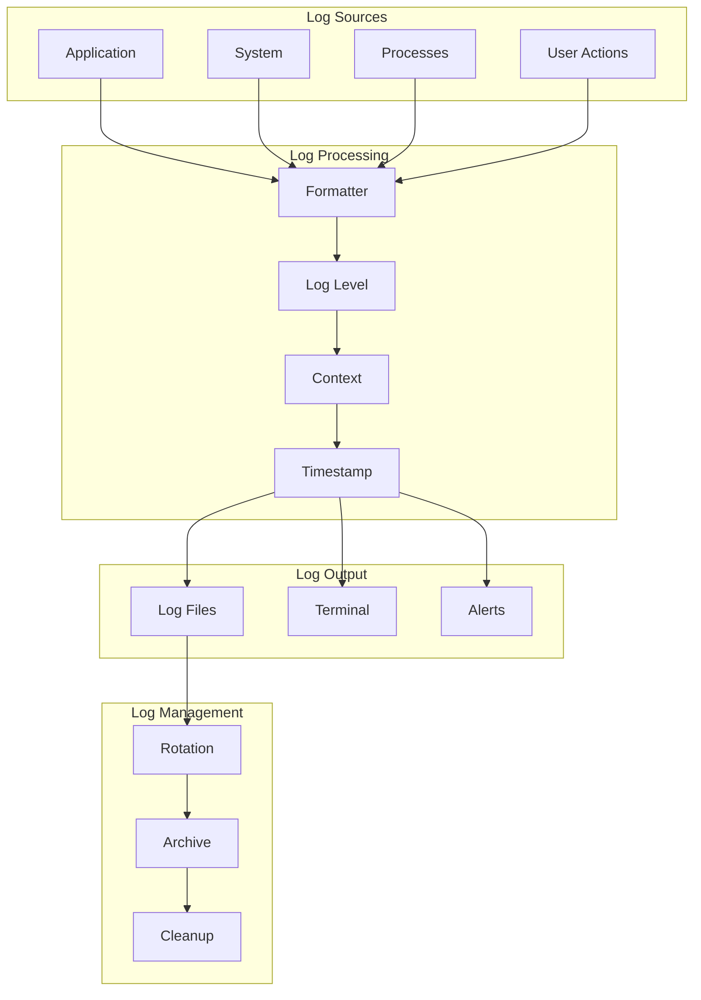
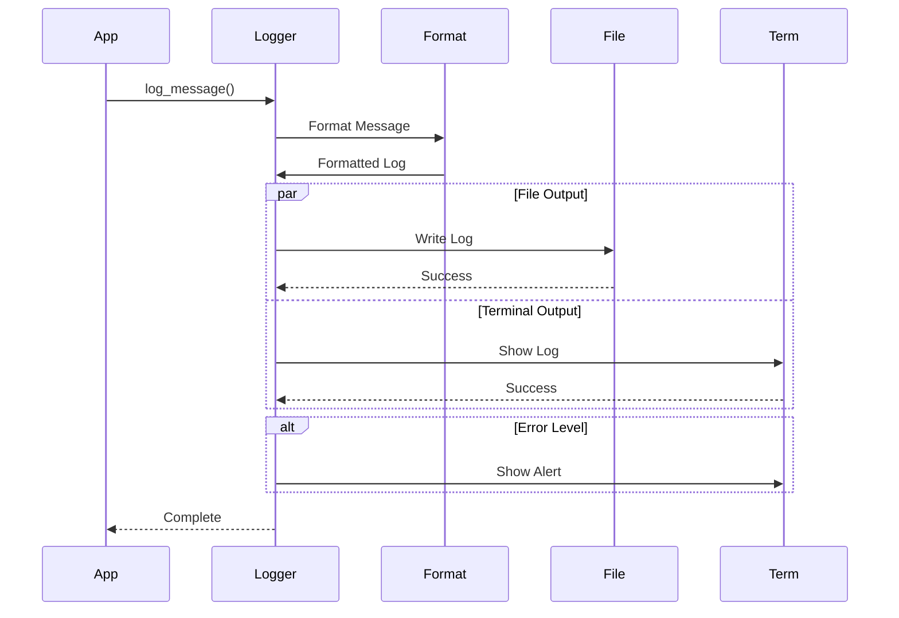
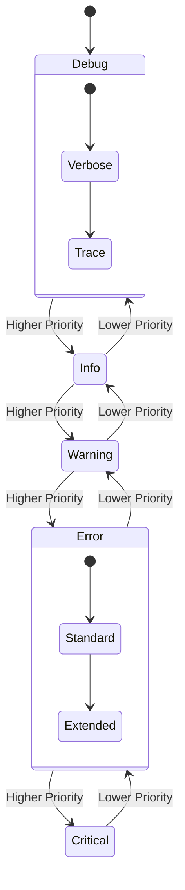
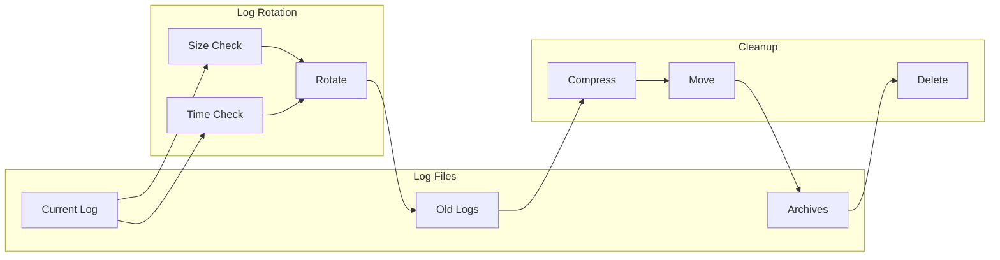
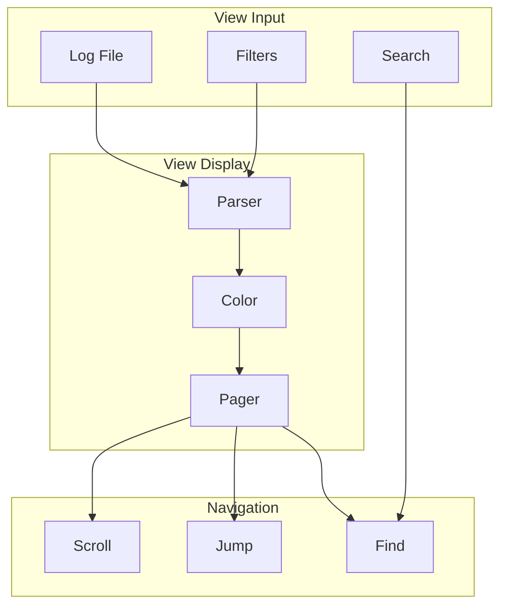
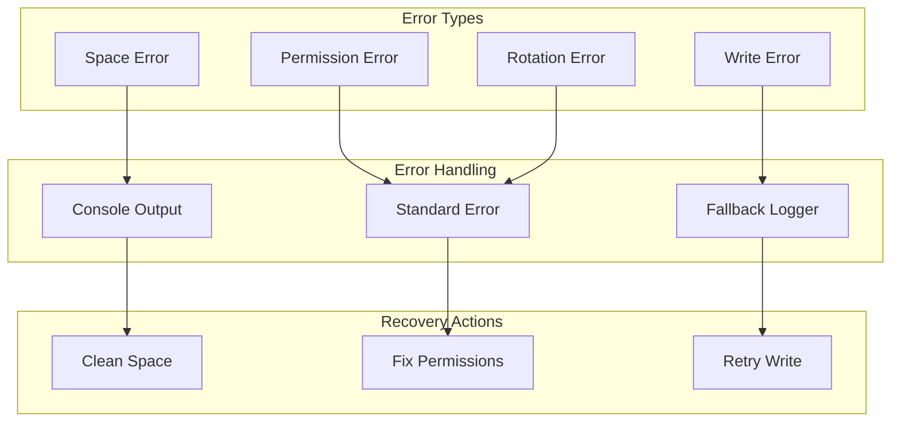

# Logging System

The logging system provides comprehensive logging capabilities with proper log management, rotation, and viewing.

## Logging Architecture



## Logging Flow



## Log Level Management



## Log File Management



## Log Viewing System



## Key Features

- Multi-level logging
- Contextual logging
- Log rotation
- Color output
- Log viewing
- Search capability
- Log archival
- Error tracking

## Usage Example

```bash
# Initialize logging system
init_logging_system

# Log messages at different levels
log_error "Error message"
log_warning "Warning message"
log_info "Info message"
log_debug "Debug message"

# View logs
show_log_viewer "system"

# Clean up old logs
cleanup_old_logs
```

## Error Handling



## Best Practices

1. Use appropriate log levels
2. Include context in logs
3. Configure log rotation
4. Monitor log size
5. Archive old logs
6. Handle write errors
7. Format logs consistently
8. Set retention policies
9. Secure log files 