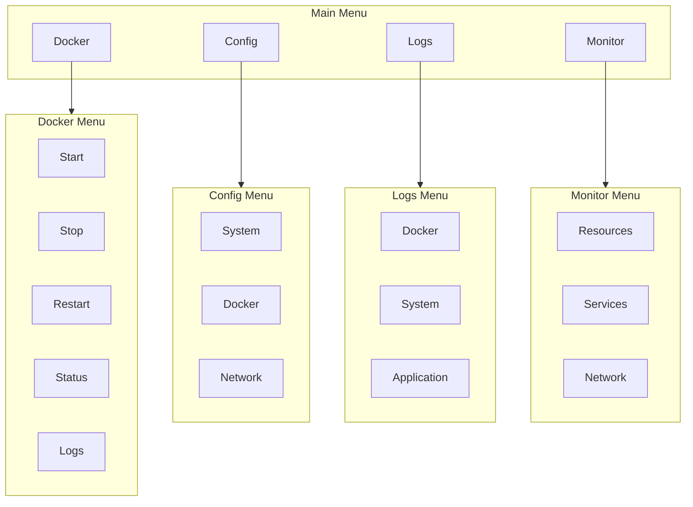
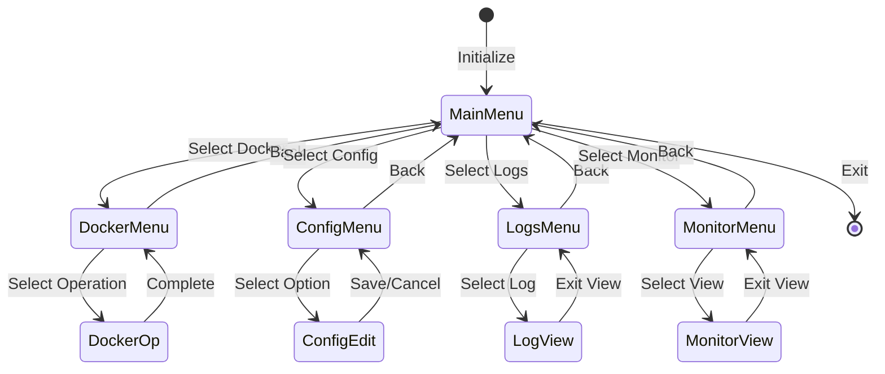
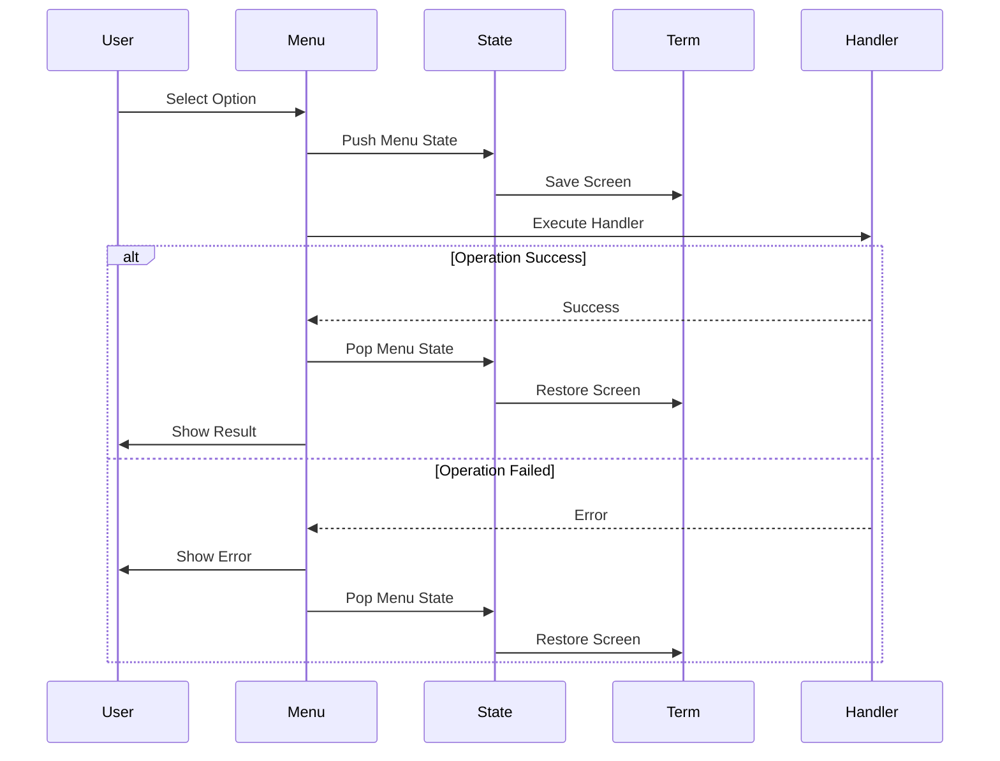
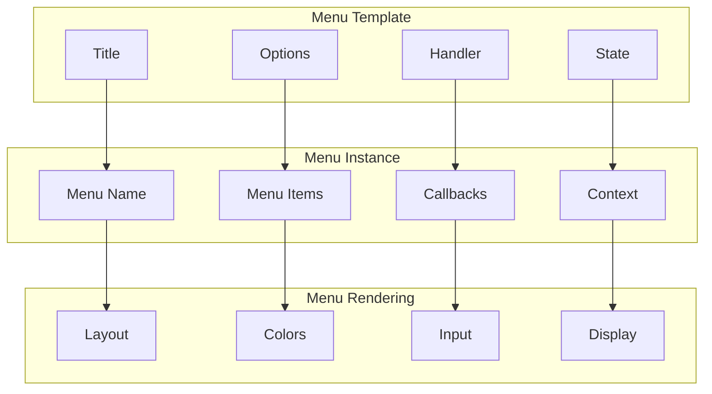
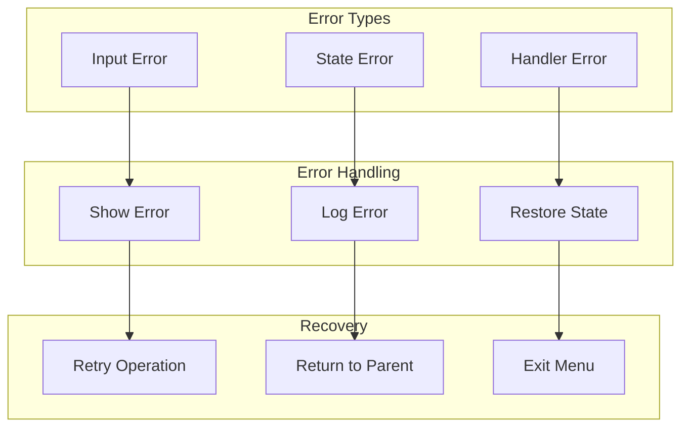

# Menu System

The menu system provides a hierarchical menu structure with proper state management and user interaction handling.

## Menu Hierarchy



## Menu State Flow



## Menu Operation Flow



## Menu Template System



## Error Handling



## Key Features

- Hierarchical menu structure
- State-aware menu transitions
- Consistent error handling
- Theme-aware rendering
- Context preservation
- Input validation
- Screen management

## Usage Example

```bash
# Define a menu using the template
show_menu_template "main" "Main Menu" "Select an option:" \
    "Docker" "Manage Docker services" \
    "Config" "Configure settings" \
    "Logs" "View logs" \
    "Monitor" "System status" \
    "Back" "Exit"

# Define a menu handler
handle_main_menu_action() {
    local action="$1"
    case $action in
        "Docker")
            show_docker_menu
            ;;
        "Config")
            show_config_menu
            ;;
        *)
            return 0
            ;;
    esac
}
```

## Best Practices

1. Use menu templates for consistency
2. Implement proper state management
3. Handle all error cases
4. Provide clear navigation paths
5. Maintain menu context
6. Clean up on exit
7. Validate user input
8. Show operation status
9. Use consistent styling 