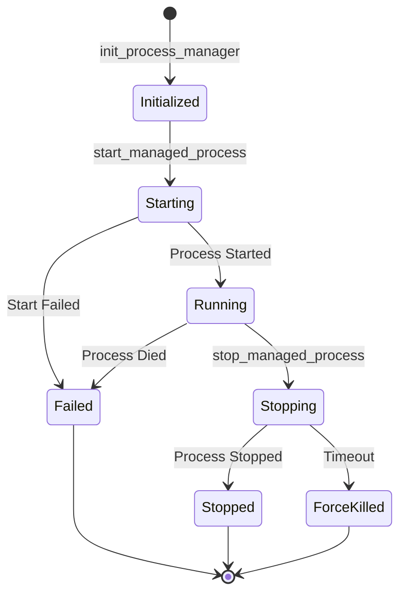
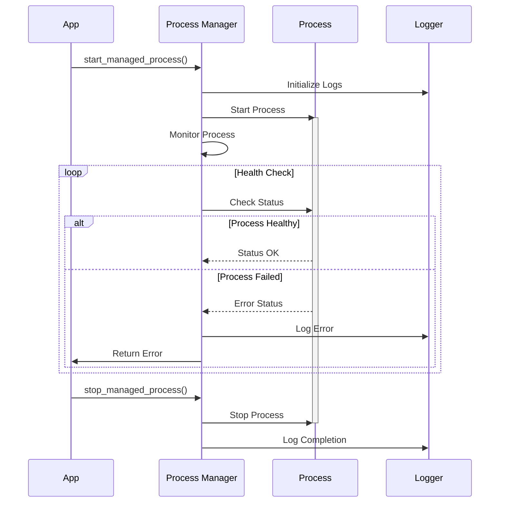
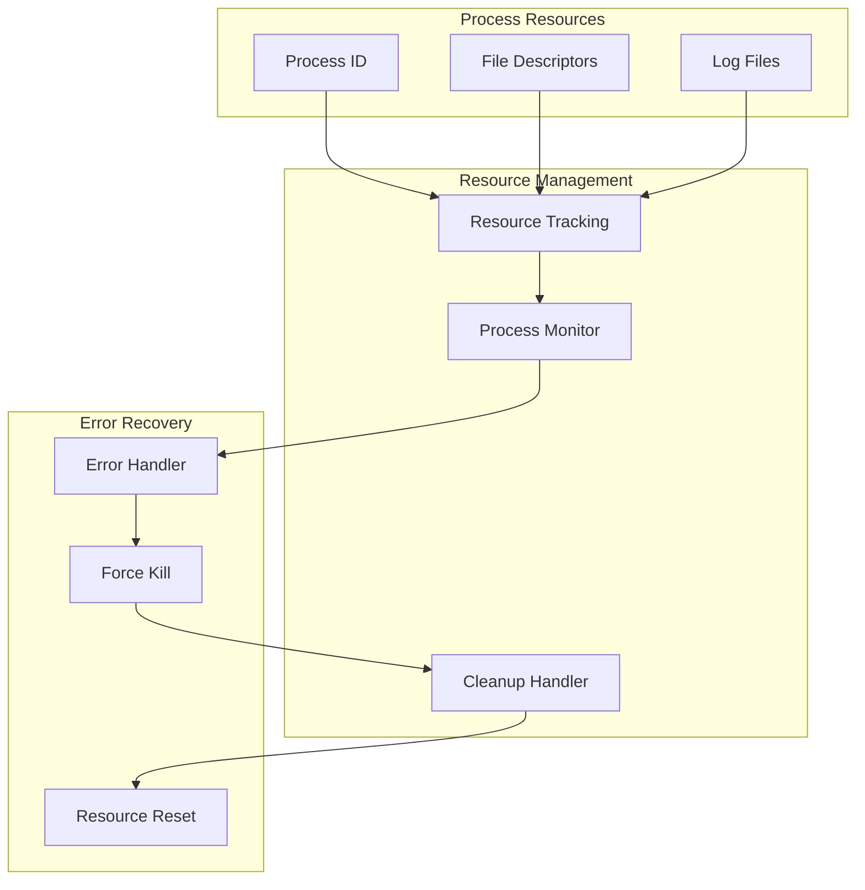
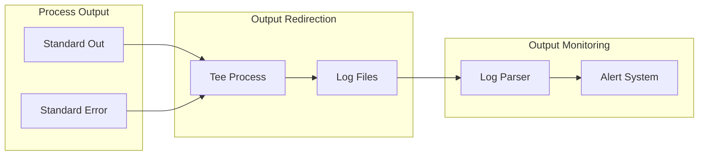
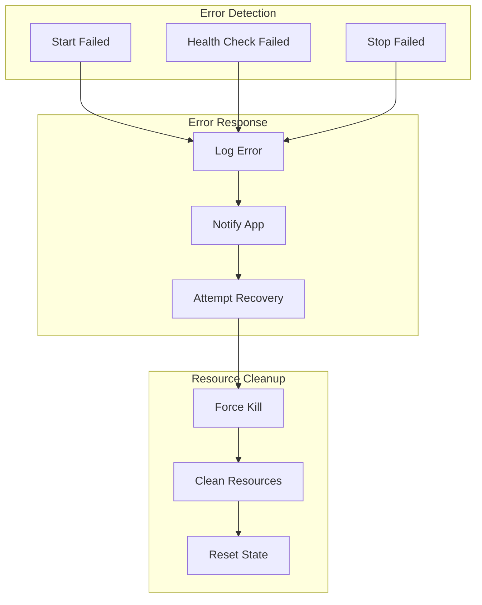

# Process Management

The process management system handles long-running processes with proper monitoring and cleanup.

## Process Lifecycle



## Process Management Flow



## Resource Management



## Output Handling



## Key Features

- Process lifecycle management
- Output redirection and logging
- Health monitoring
- Resource cleanup
- Error recovery

## Usage Example

```bash
# Initialize process manager
init_process_manager

# Start a managed process
start_managed_process "process_name" "command" [timeout]

# Monitor process status
get_process_status "process_name"

# View process logs
tail_process_logs "process_name"

# Stop process
stop_managed_process "process_name"

# Clean up resources
cleanup_processes
```

## Error Handling Strategy



## Best Practices

1. Always use managed processes for long-running operations
2. Set appropriate timeouts for operations
3. Handle all output streams
4. Implement proper health checks
5. Clean up resources on exit
6. Log all process lifecycle events
7. Use atomic operations for state changes 