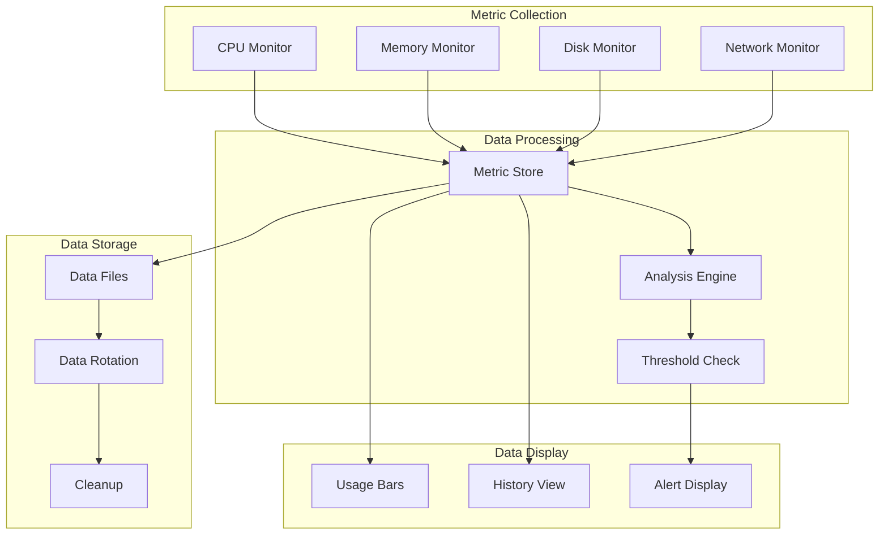
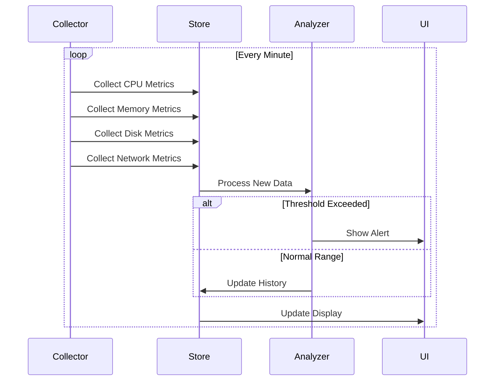
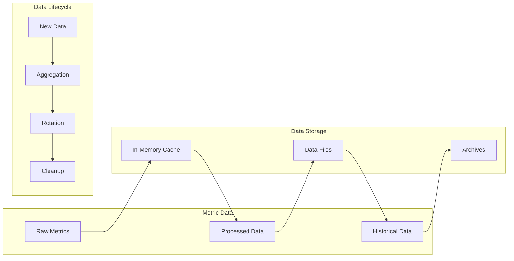
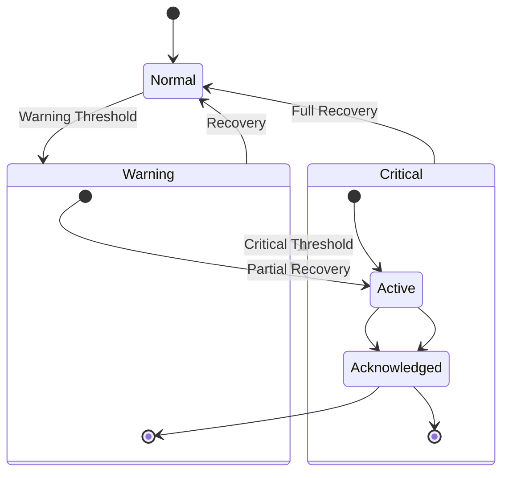
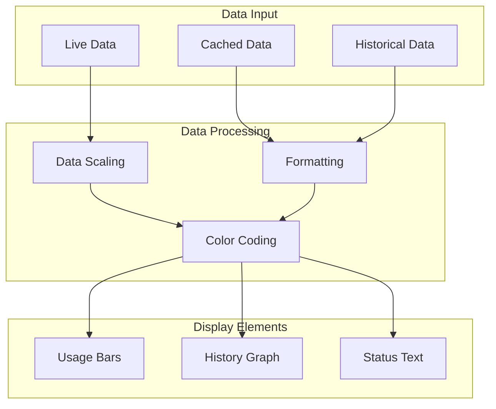
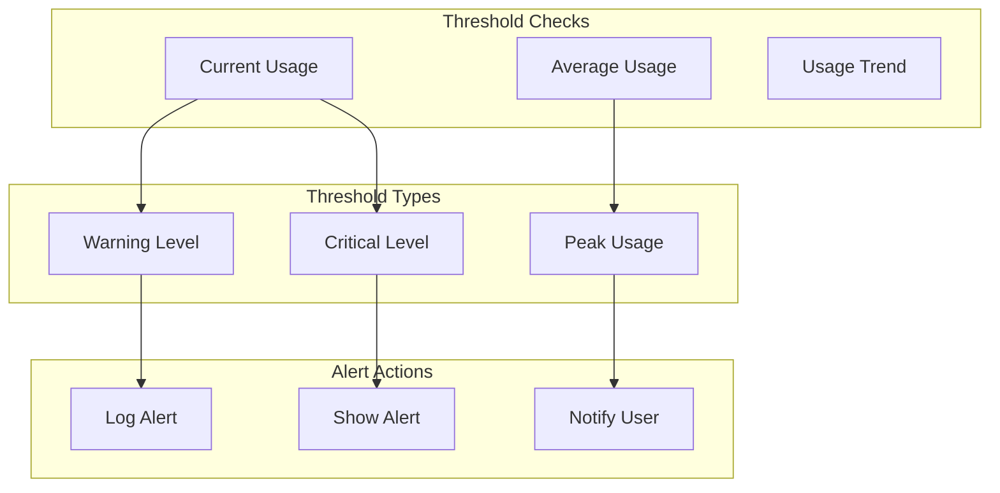

# Resource Monitor

The resource monitoring system provides real-time system metrics collection, analysis, and visualization.

## Monitoring Architecture



## Metric Collection Flow



## Data Management



## Alert System



## Visualization System



## Key Features

- Real-time metric collection
- Threshold monitoring
- Historical data tracking
- Alert management
- Resource visualization
- Data rotation
- Cross-platform support

## Usage Example

```bash
# Initialize resource monitor
init_resource_monitor

# Show live resource usage
show_resource_monitor

# View resource history
show_resource_history "cpu"
show_resource_history "memory"
show_resource_history "disk"

# Clean up old data
cleanup_resource_monitor
```

## Threshold Management



## Best Practices

1. Set appropriate collection intervals
2. Configure meaningful thresholds
3. Implement data rotation
4. Monitor alert frequency
5. Track historical trends
6. Clean up old data
7. Validate metric accuracy
8. Handle collection errors
9. Document threshold values 