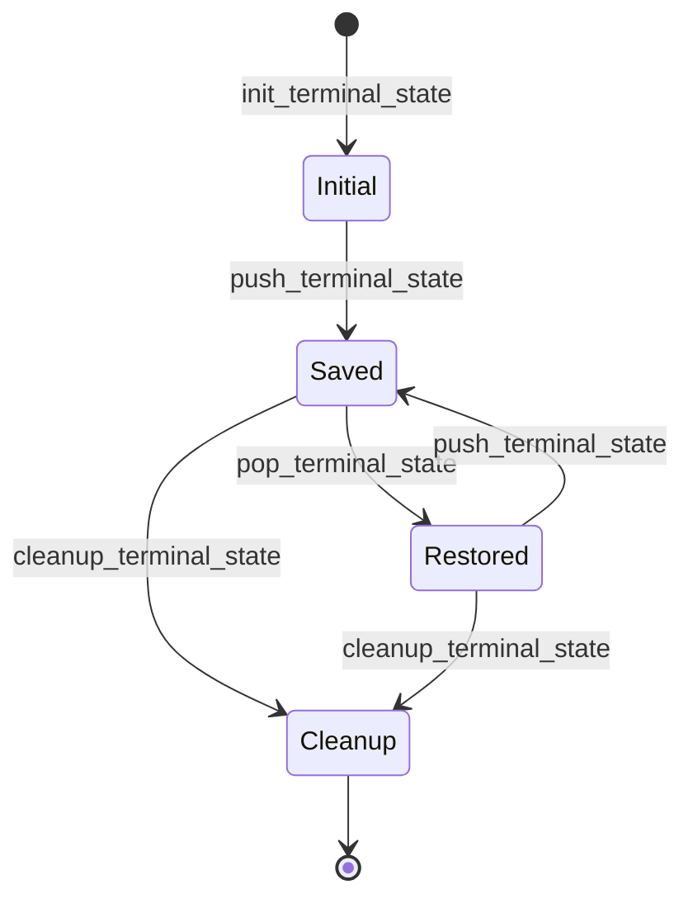
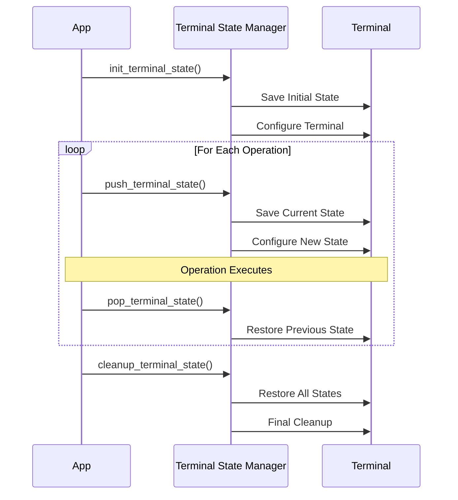
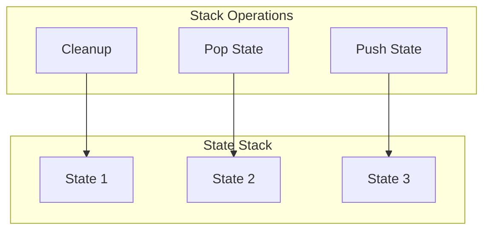
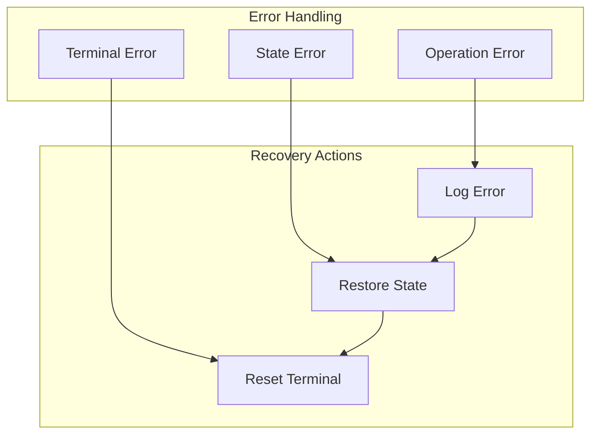

# Terminal State Management

The terminal state management system provides robust handling of terminal states and cleanup.

## State Stack Flow



## Operation Flow



## State Stack Management



## Key Features

- Maintains a stack of terminal states
- Ensures proper state restoration
- Handles cleanup on errors
- Manages terminal attributes
- Provides safe state transitions

## Usage Example

```bash
# Initialize terminal state
init_terminal_state

# Save current state for operation
push_terminal_state "operation_name"

# Execute operation with clean state
do_operation

# Restore previous state
pop_terminal_state "operation_name"

# Final cleanup
cleanup_terminal_state
```

## Error Handling



## Best Practices

1. Always pair push/pop operations
2. Use with_terminal_state for automatic cleanup
3. Handle errors at each state transition
4. Verify state restoration success
5. Clean up resources on exit 