# Microservice Architecture: From Theory to Practice

## Core Concepts in Action

Our development environment implements a modern microservice architecture with specific opinions and patterns. Let's understand the what, why, and how.

### The Big Picture

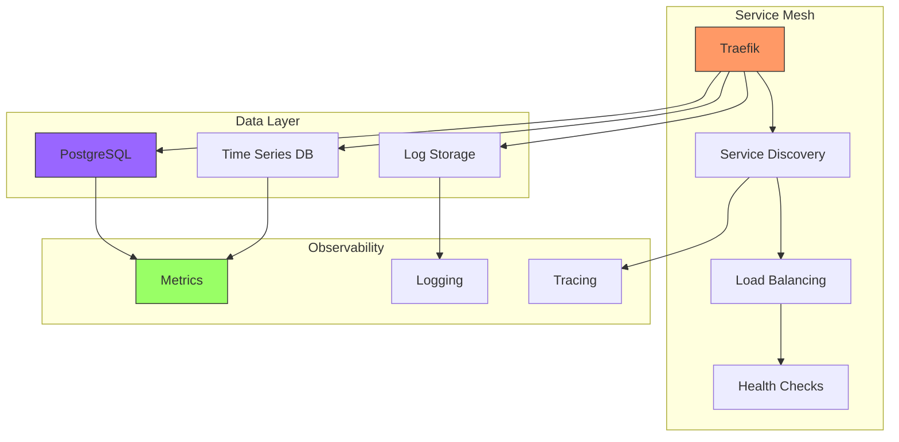

## Key Architectural Patterns

### 1. Service Discovery Pattern

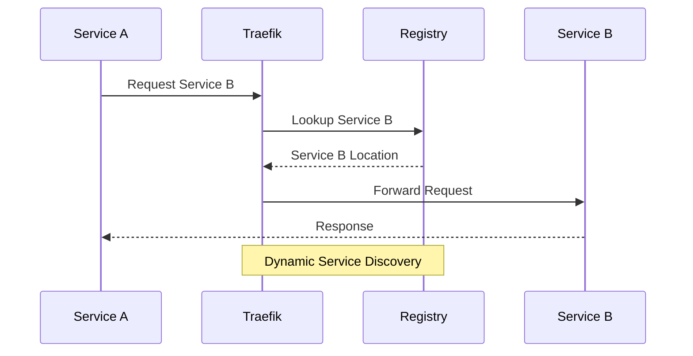

Why This Matters:
- Services can scale independently
- Zero-configuration networking
- Automatic load balancing
- Health-aware routing

### 2. Data Management Pattern

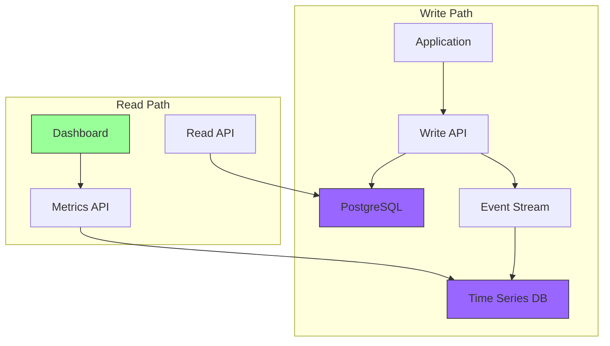

Why This Pattern:
- Separation of concerns
- Optimized read/write paths
- Data consistency
- Performance optimization

### 3. Observability Pattern

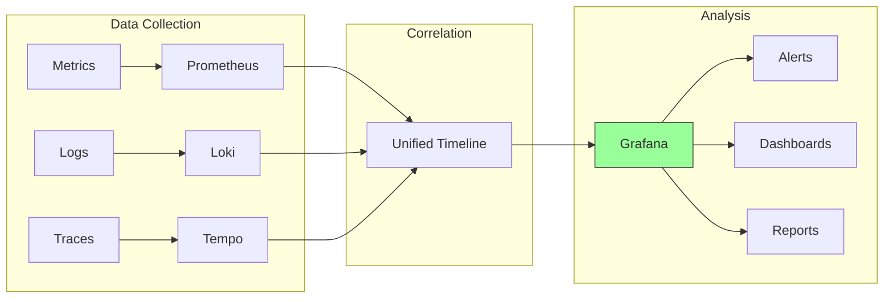

Benefits:
- Complete system visibility
- Correlated monitoring
- Proactive issue detection
- Performance insights

## Understanding Our Opinions

### 1. API Gateway Pattern (Traefik)

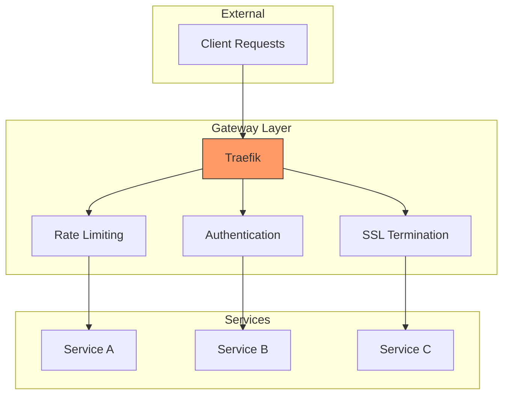

Why Traefik:
- Dynamic configuration
- Automatic service discovery
- Modern protocol support
- Easy SSL management

### 2. Data Storage Pattern

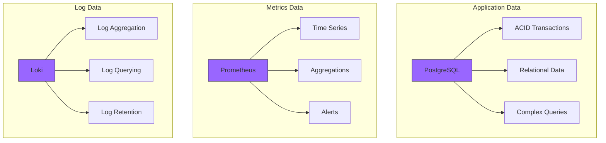

Our Storage Choices:
- PostgreSQL for relational data
- Prometheus for metrics
- Loki for logs

### 3. Development Workflow Pattern

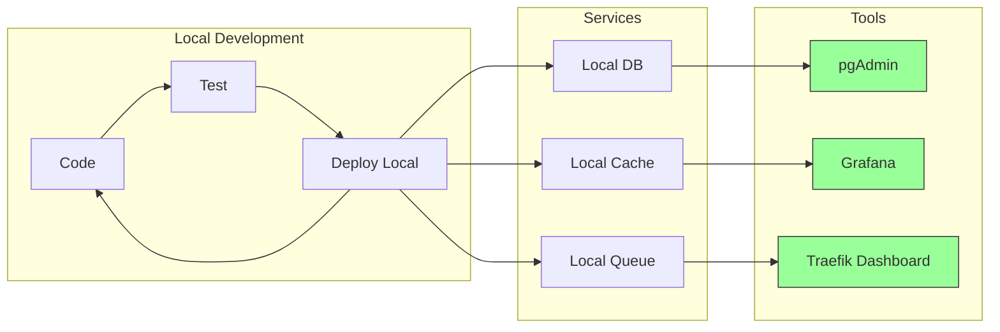

## Advanced Concepts

### 1. Health Management Pattern

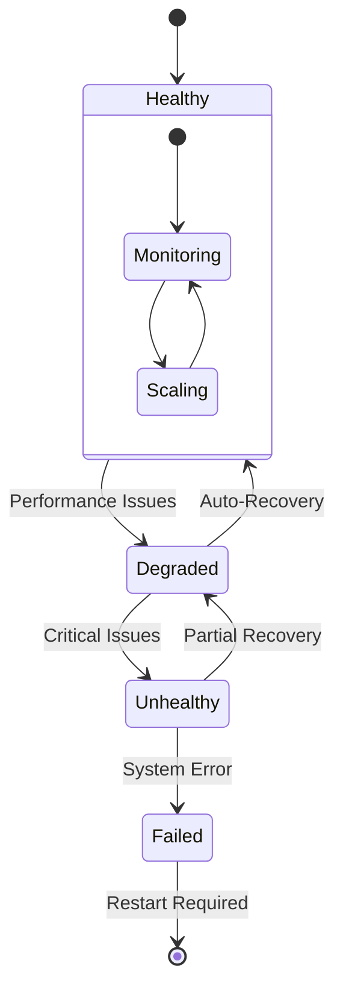

### 2. Configuration Management

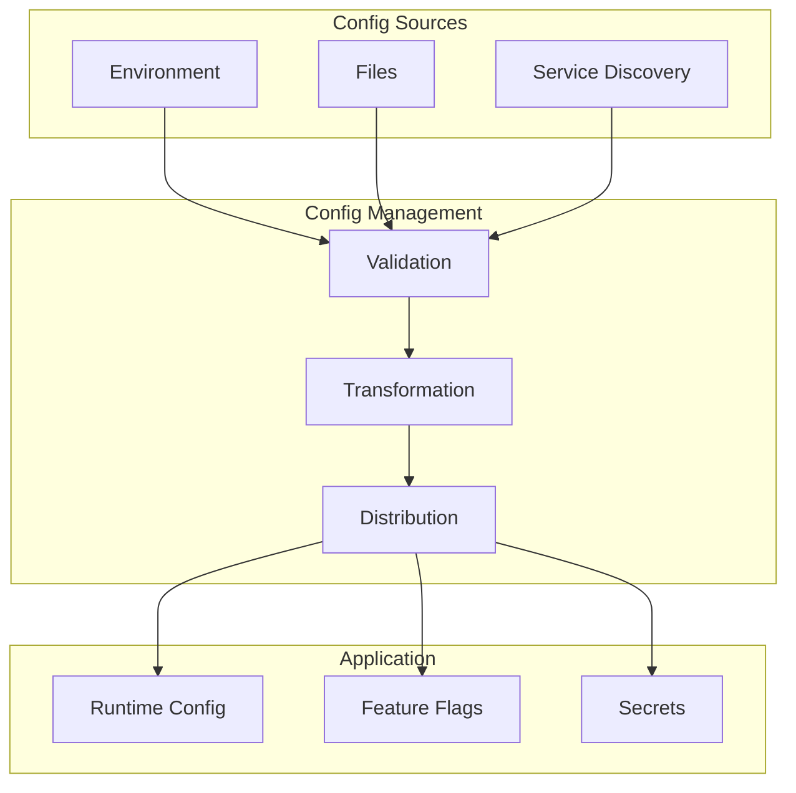

## Best Practices

### 1. Service Independence

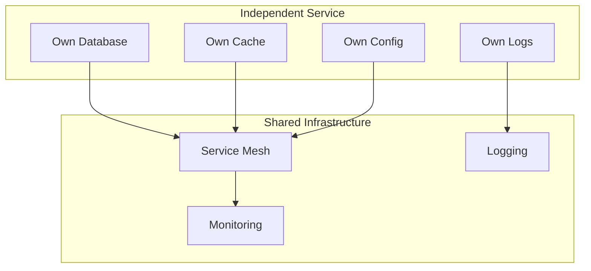

### 2. Failure Handling

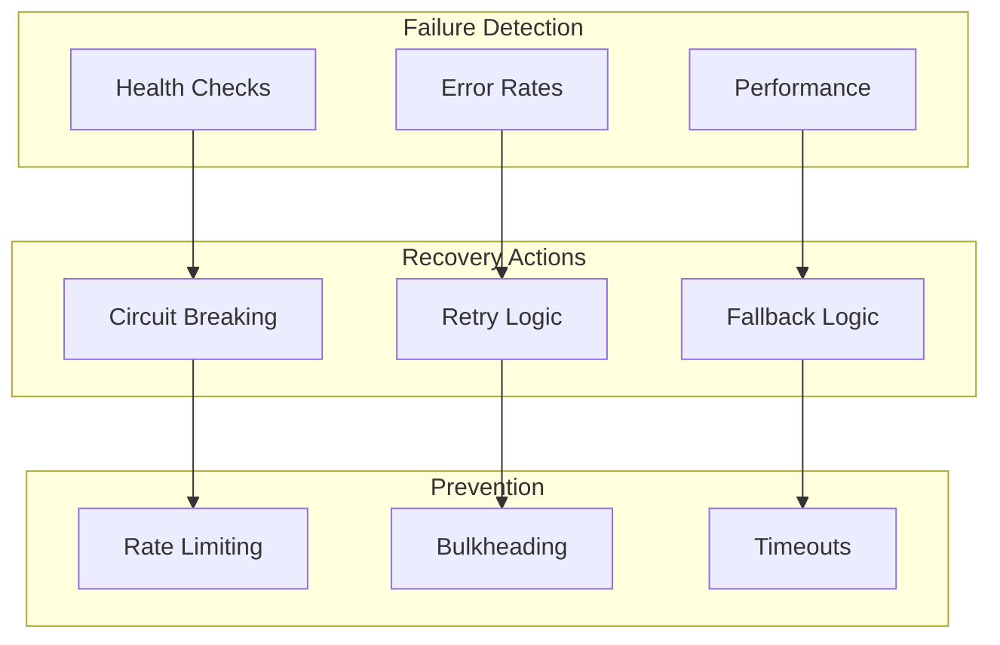

## Real-World Application

### Example: E-Commerce System

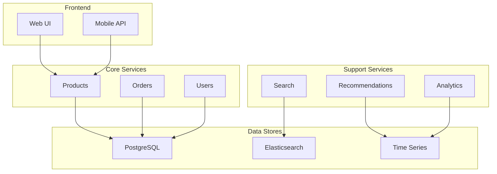

Remember:
1. Start simple
2. Add complexity only when needed
3. Monitor everything
4. Automate what you can
5. Keep services independent
6. Plan for failure

This architecture guide provides a foundation for understanding how our tool implements microservices. The patterns and practices shown here are battle-tested and proven in production environments. 