# From Theory to Practice: Implementing Our Architecture

## Our Opinionated Stack

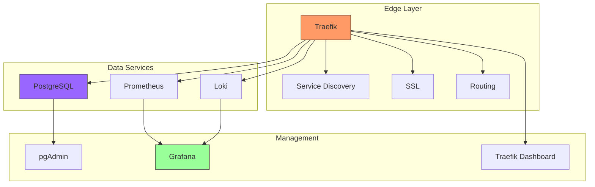

## Why These Choices?

### 1. Edge Layer (Traefik)

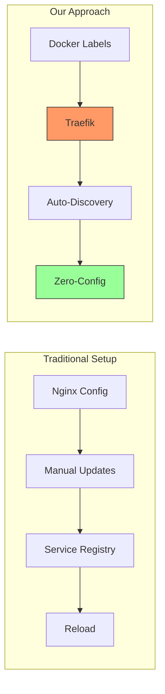

Benefits:
- Zero-configuration service discovery
- Automatic SSL management
- Real-time config updates
- Modern protocols (HTTP/2, WebSocket)

### 2. Data Layer Design

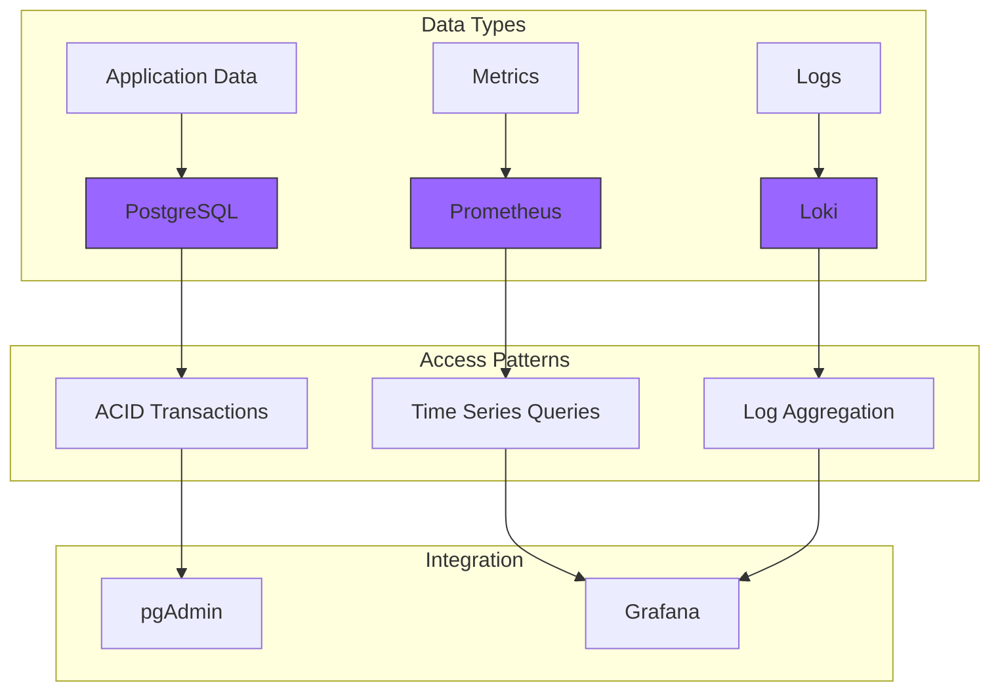

### 3. Monitoring Stack

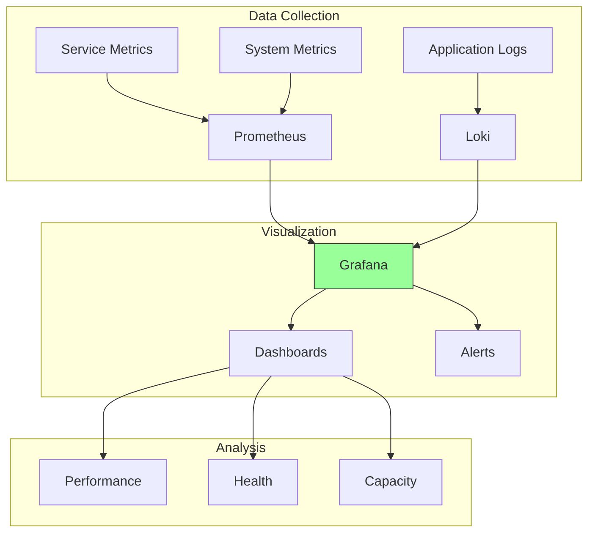

## Implementation Details

### 1. Service Configuration

```yaml
# Example Traefik Service Label
services:
  api:
    labels:
      - "traefik.enable=true"
      - "traefik.http.routers.api.rule=Host(`api.localhost`)"
      - "traefik.http.services.api.loadbalancer.server.port=8000"
```

### 2. Data Storage Configuration

```yaml
# Example PostgreSQL Service
services:
  postgres:
    image: postgres:14
    environment:
      POSTGRES_PASSWORD: ${DB_PASSWORD}
    volumes:
      - postgres_data:/var/lib/postgresql/data
    labels:
      - "traefik.enable=false"  # Direct access not needed
```

### 3. Monitoring Configuration

```yaml
# Example Prometheus Configuration
services:
  prometheus:
    image: prom/prometheus
    volumes:
      - ./prometheus.yml:/etc/prometheus/prometheus.yml
    command:
      - '--config.file=/etc/prometheus/prometheus.yml'
      - '--storage.tsdb.path=/prometheus'
      - '--web.console.libraries=/usr/share/prometheus/console_libraries'
      - '--web.console.templates=/usr/share/prometheus/consoles'
```

## Development Workflow

### 1. Local Development Cycle

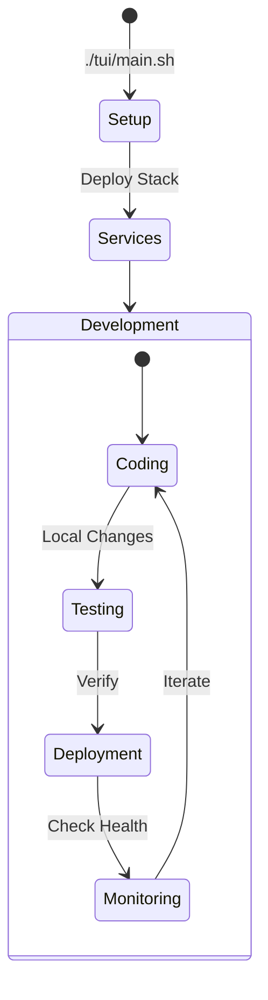

### 2. Service Lifecycle

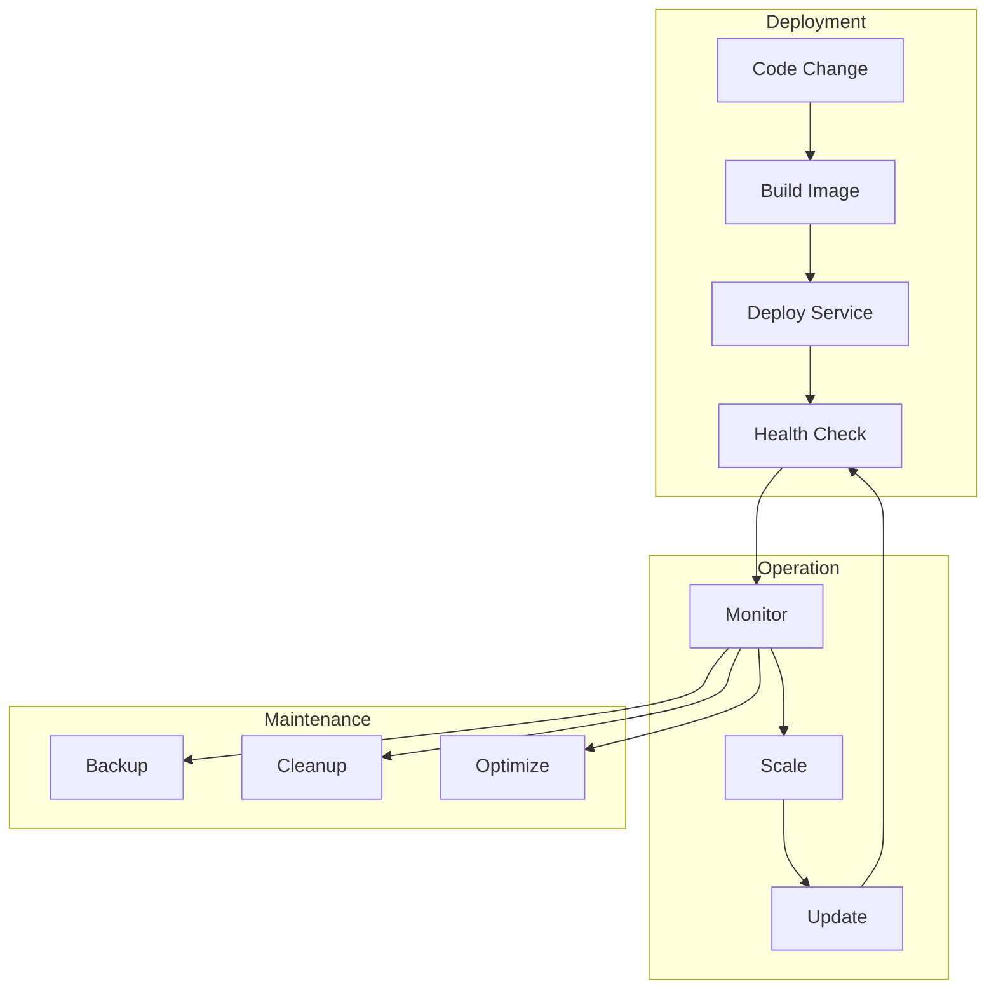

## Best Practices Implementation

### 1. Service Health Checks

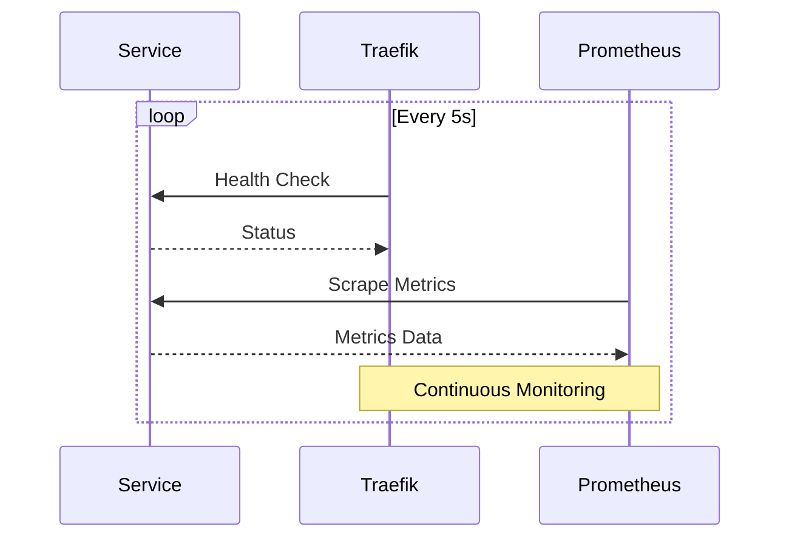

### 2. Data Backup Strategy

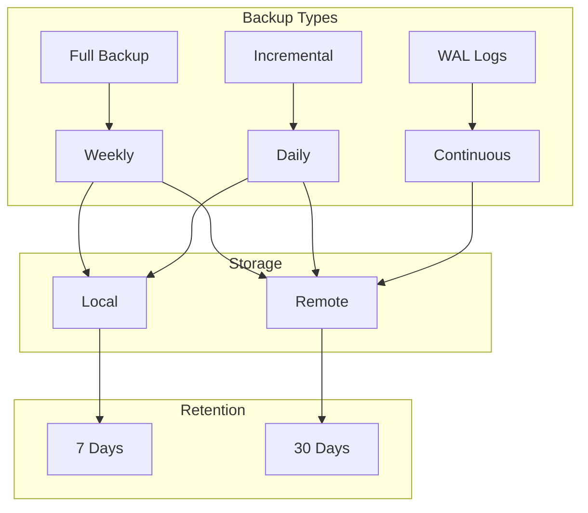

## Scaling Considerations

### 1. Vertical Scaling

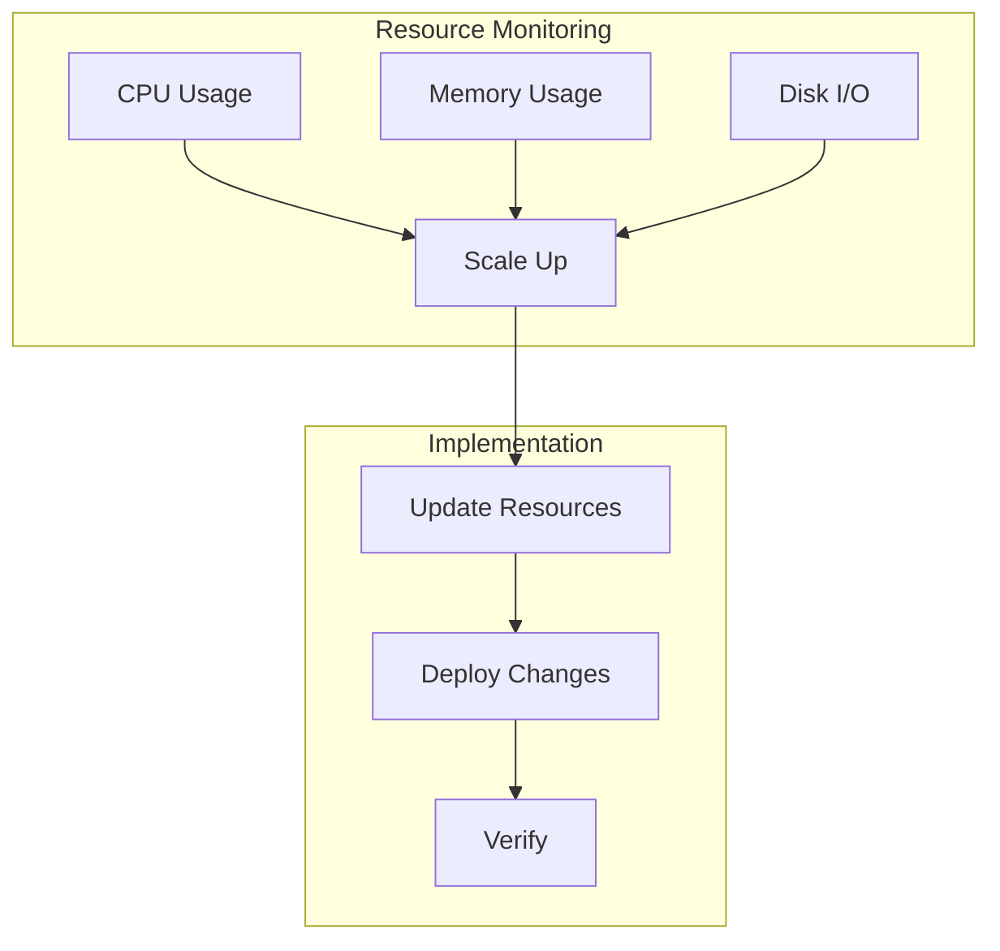

### 2. Horizontal Scaling

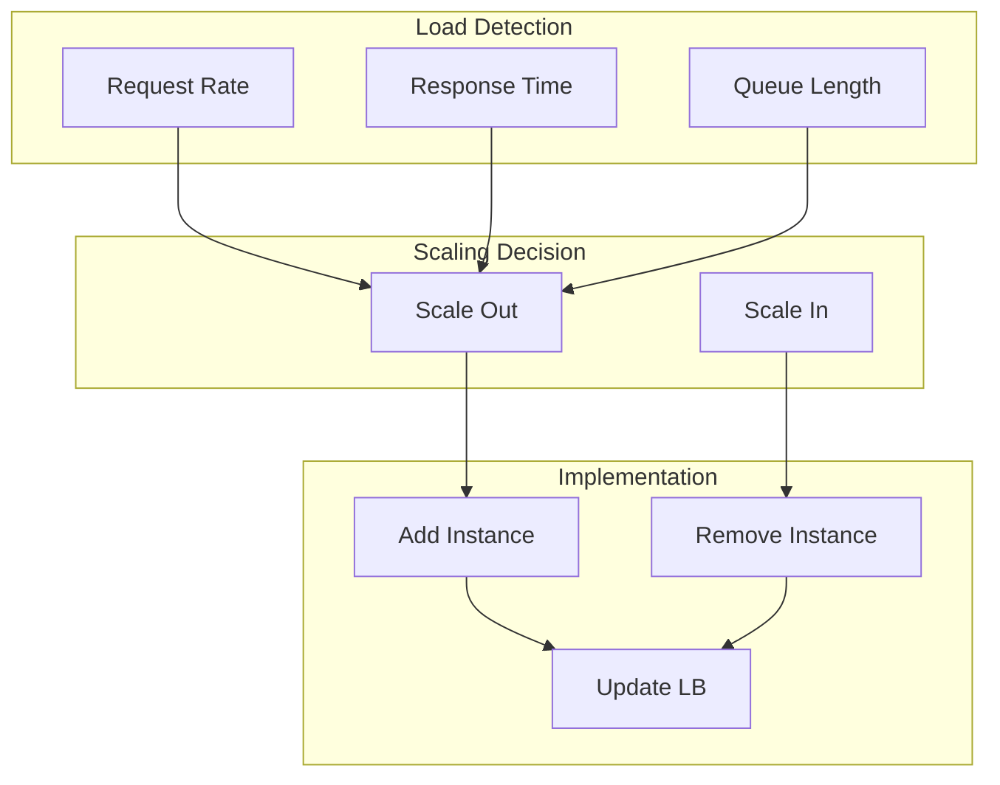

## Troubleshooting Guide

### 1. Issue Detection

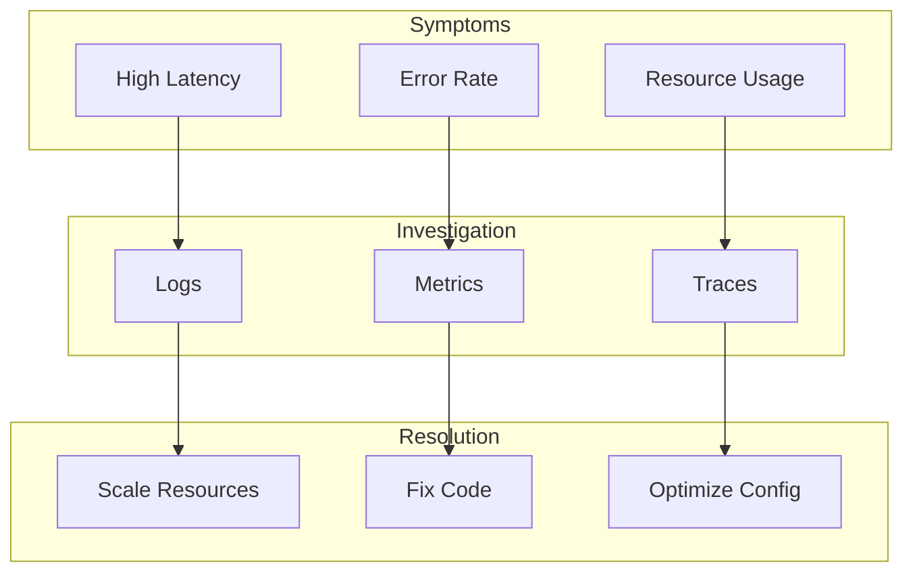

Remember:
1. Start with the base stack
2. Add components as needed
3. Monitor from day one
4. Backup regularly
5. Scale gradually
6. Keep it simple

This guide shows how our architectural decisions are implemented in practice, making it easier to understand the "why" behind each choice. 