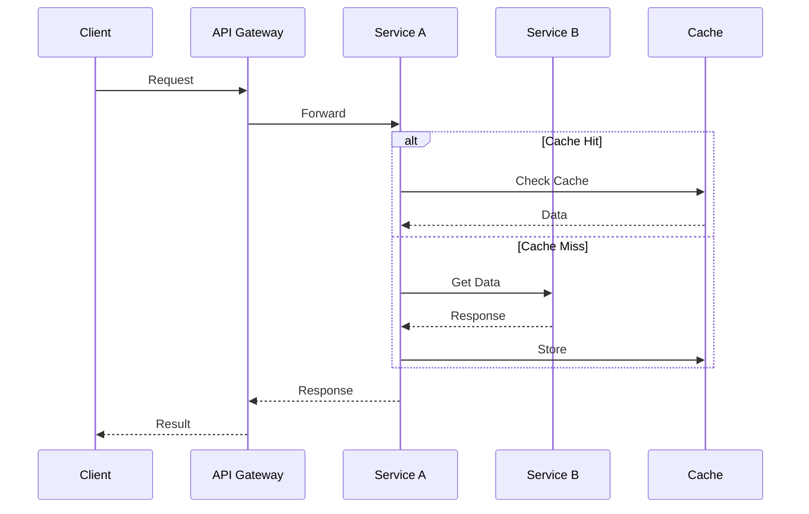
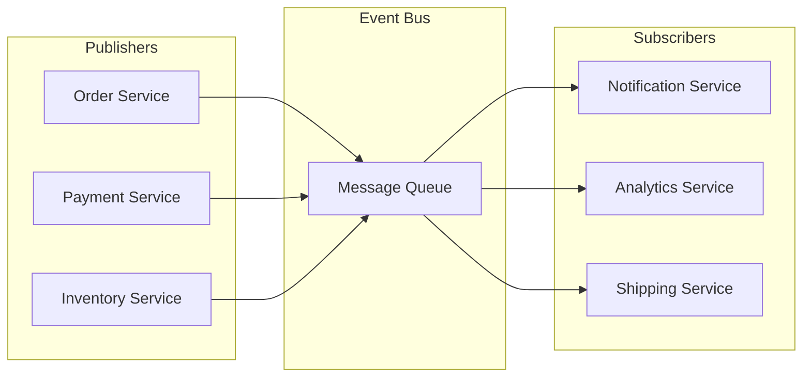
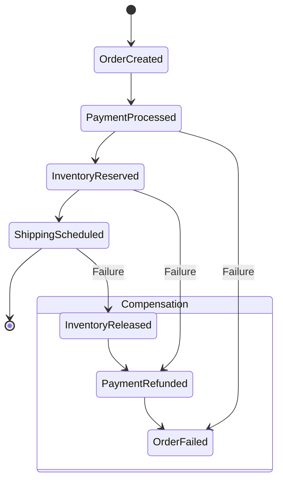
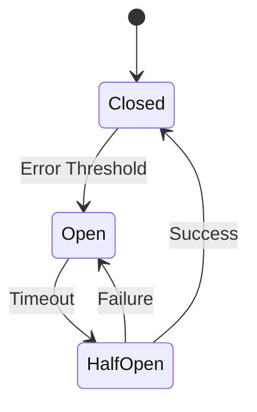
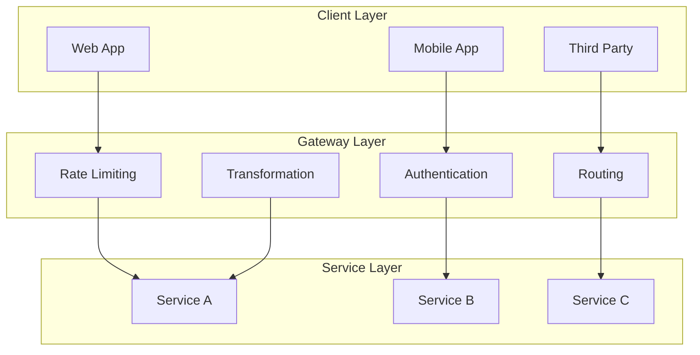
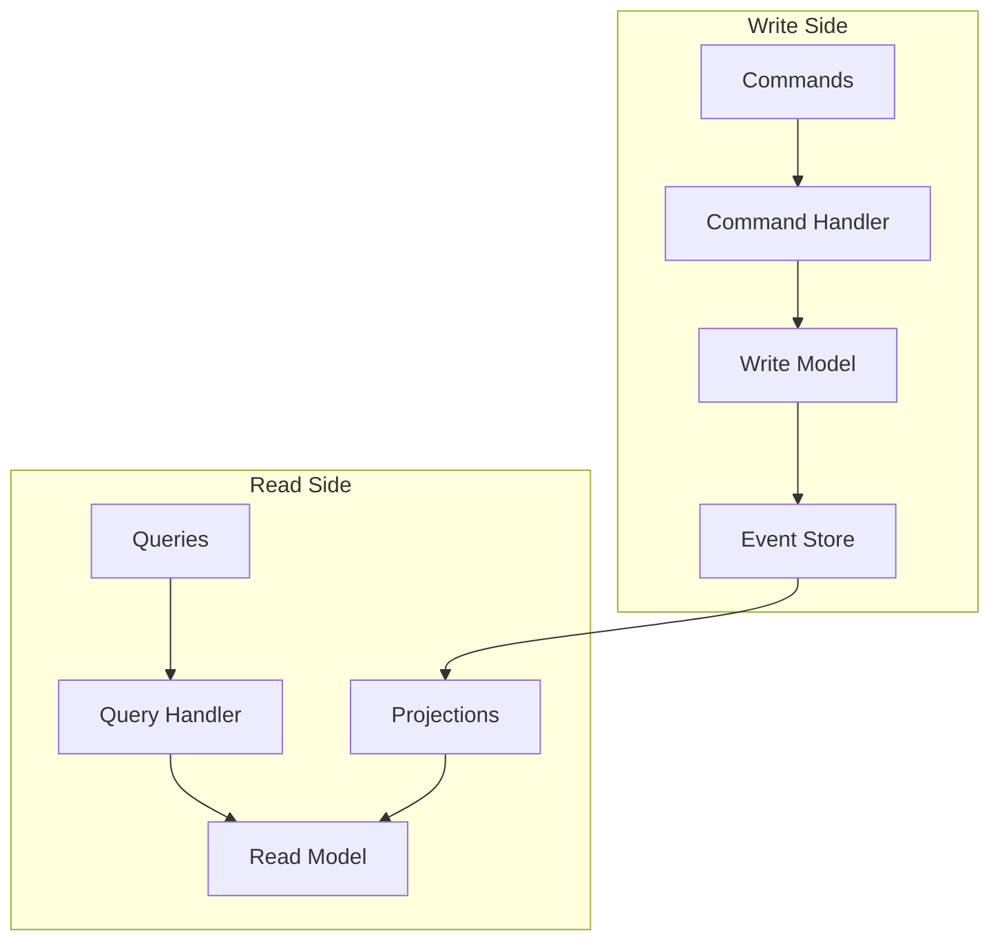
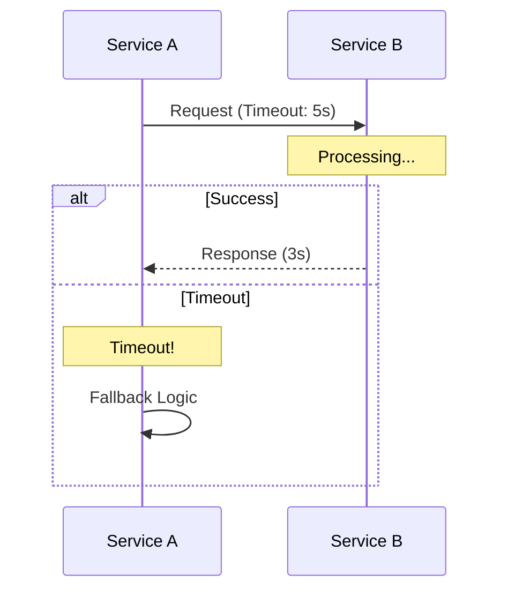
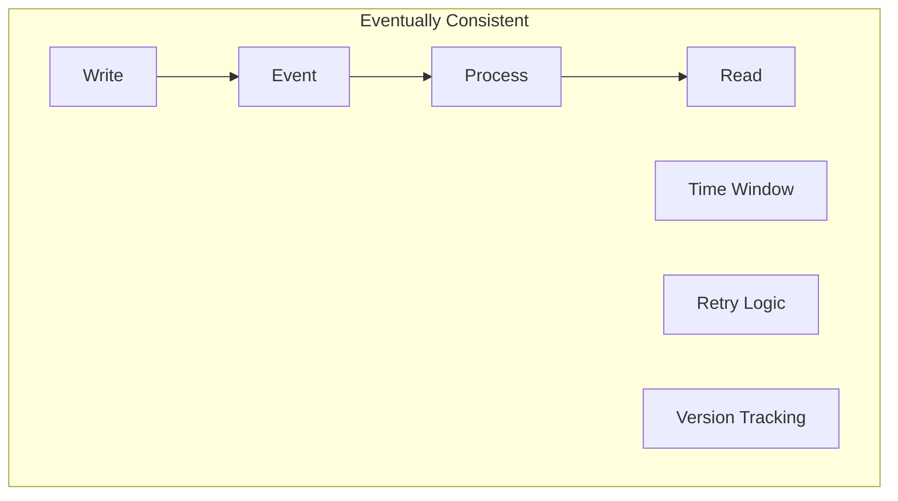
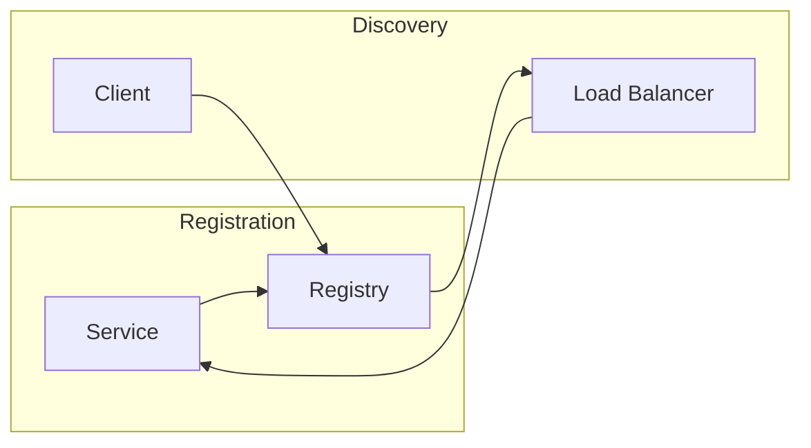

# Microservice Communication Recipes

## Common Communication Patterns

### 1. Request-Response Pattern



**When to Use:**
- Direct service-to-service communication
- Synchronous operations
- CRUD operations

**Recipe Ingredients:**
```yaml
# Traefik Configuration
services:
  service-a:
    labels:
      - "traefik.http.middlewares.retry.retry.attempts=3"
      - "traefik.http.middlewares.retry.retry.initialInterval=100ms"
```

### 2. Event-Driven Pattern



**When to Use:**
- Decoupled services
- Asynchronous operations
- Event logging
- Analytics

**Recipe Ingredients:**
```yaml
# RabbitMQ Configuration
services:
  rabbitmq:
    image: rabbitmq:3-management
    environment:
      - RABBITMQ_DEFAULT_USER=user
      - RABBITMQ_DEFAULT_PASS=password
```

### 3. Saga Pattern



**When to Use:**
- Distributed transactions
- Multi-step processes
- Compensation logic needed

**Recipe Ingredients:**
```yaml
# State Management Service
services:
  state-manager:
    environment:
      - SAGA_TIMEOUT=30s
      - RETRY_ATTEMPTS=3
      - COMPENSATION_ENABLED=true
```

### 4. Circuit Breaker Pattern



**When to Use:**
- Prevent cascading failures
- Handle service outages
- Graceful degradation

**Recipe Ingredients:**
```yaml
# Circuit Breaker Configuration
services:
  api:
    environment:
      - CIRCUIT_THRESHOLD=5
      - CIRCUIT_TIMEOUT=10s
      - CIRCUIT_RESET=30s
```

### 5. API Gateway Pattern



**When to Use:**
- Single entry point needed
- Cross-cutting concerns
- API versioning
- Request transformation

**Recipe Ingredients:**
```yaml
# Traefik Gateway Configuration
services:
  traefik:
    command:
      - "--api.dashboard=true"
      - "--providers.docker=true"
      - "--entrypoints.web.address=:80"
```

### 6. CQRS Pattern



**When to Use:**
- Complex domains
- Different read/write patterns
- Event sourcing
- Performance optimization

**Recipe Ingredients:**
```yaml
# Event Store Configuration
services:
  eventstore:
    image: eventstore/eventstore
    environment:
      - EVENTSTORE_CLUSTER_SIZE=1
      - EVENTSTORE_RUN_PROJECTIONS=All
```

## Common Gotchas

### 1. Network Timeouts



**Solution Recipe:**
```yaml
services:
  service-a:
    environment:
      - HTTP_TIMEOUT=5s
      - FALLBACK_ENABLED=true
```

### 2. Data Consistency



**Solution Recipe:**
```yaml
services:
  database:
    environment:
      - CONSISTENCY_LEVEL=eventual
      - SYNC_INTERVAL=1s
```

### 3. Service Discovery



**Solution Recipe:**
```yaml
services:
  consul:
    image: consul
    environment:
      - CONSUL_BIND_INTERFACE=eth0
```

Remember:
1. Start with simple patterns
2. Add complexity when needed
3. Monitor everything
4. Plan for failure
5. Keep services independent
6. Document your choices 