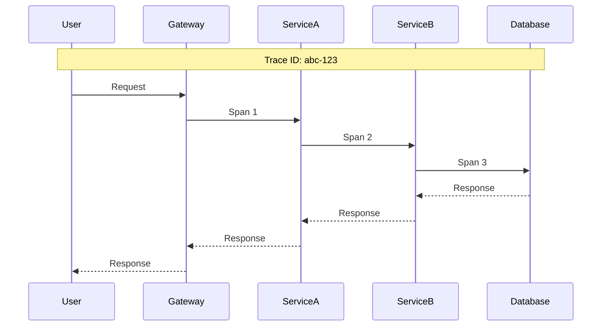
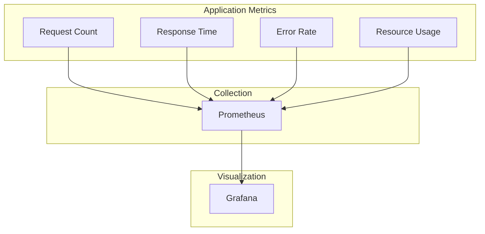
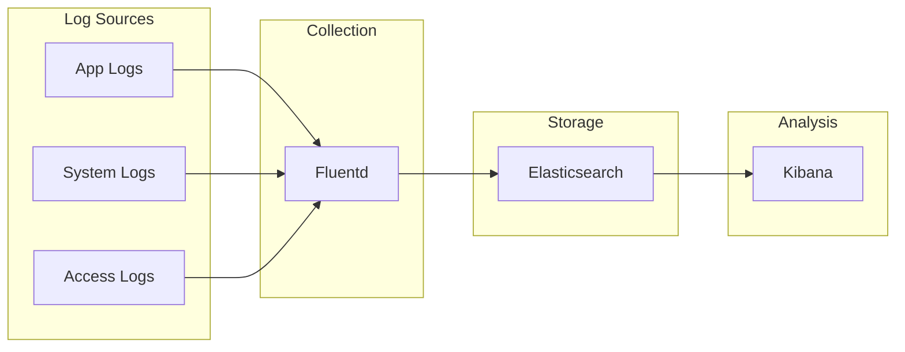
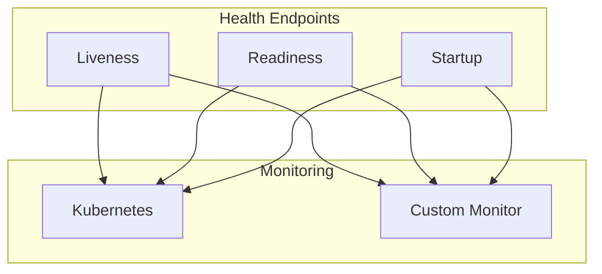
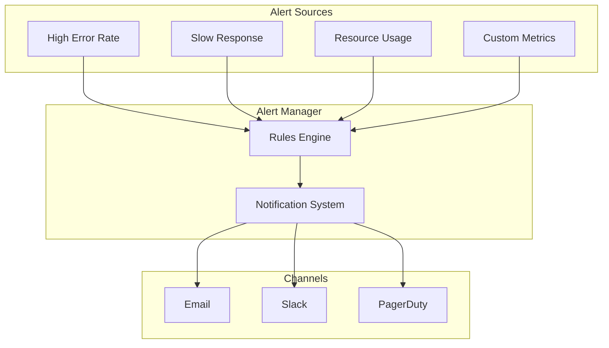
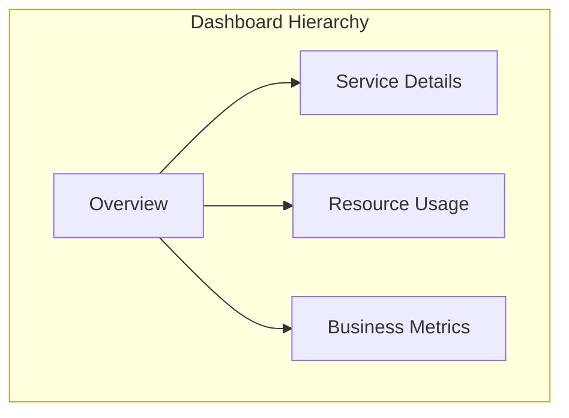
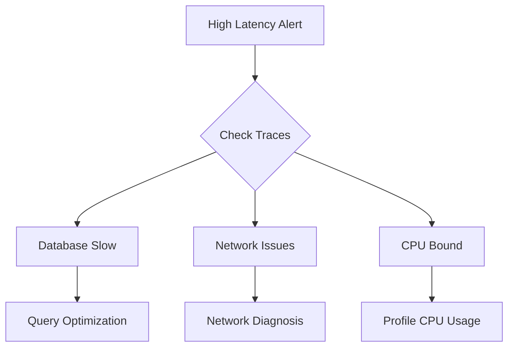
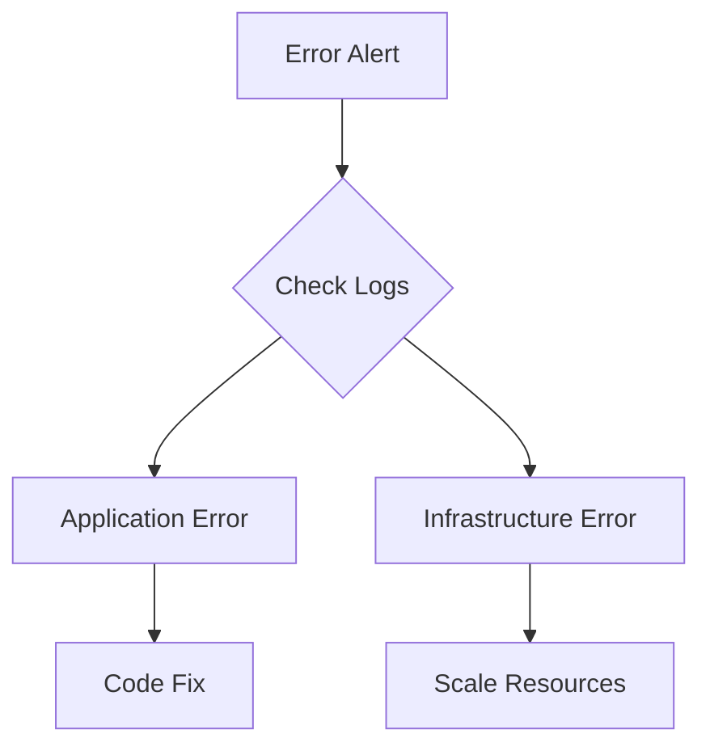

# Microservice Observability Cookbook

## Core Ingredients

### 1. Distributed Tracing



**Recipe:**
```yaml
# Jaeger Configuration
services:
  jaeger:
    image: jaegertracing/all-in-one
    environment:
      - COLLECTOR_ZIPKIN_HOST_PORT=:9411
      - COLLECTOR_OTLP_ENABLED=true
```

### 2. Metrics Collection



**Recipe:**
```yaml
# Prometheus Configuration
global:
  scrape_interval: 15s
  evaluation_interval: 15s

scrape_configs:
  - job_name: 'microservices'
    metrics_path: '/metrics'
    static_configs:
      - targets: ['service-a:8080', 'service-b:8080']
```

### 3. Log Aggregation



**Recipe:**
```yaml
# Fluentd Configuration
<source>
  @type forward
  port 24224
  bind 0.0.0.0
</source>

<match **>
  @type elasticsearch
  host elasticsearch
  port 9200
  logstash_format true
</match>
```

### 4. Health Checks



**Recipe:**
```yaml
# Health Check Configuration
livenessProbe:
  httpGet:
    path: /health/live
    port: 8080
  initialDelaySeconds: 3
  periodSeconds: 3

readinessProbe:
  httpGet:
    path: /health/ready
    port: 8080
  initialDelaySeconds: 5
  periodSeconds: 5
```

### 5. Alerting



**Recipe:**
```yaml
# Alert Manager Rules
groups:
- name: example
  rules:
  - alert: HighErrorRate
    expr: rate(http_requests_total{status=~"5.."}[5m]) > 1
    for: 5m
    labels:
      severity: critical
    annotations:
      summary: High error rate detected
```

## Best Practices

### 1. Structured Logging

```json
{
  "timestamp": "2024-02-20T10:00:00Z",
  "level": "ERROR",
  "service": "order-service",
  "trace_id": "abc-123",
  "message": "Payment processing failed",
  "error": {
    "code": "PAYMENT_001",
    "details": "Insufficient funds"
  },
  "context": {
    "user_id": "user-123",
    "order_id": "order-456"
  }
}
```

### 2. Metric Naming

```yaml
# Metric Naming Convention
http_requests_total{method="GET", path="/api/v1/users", status="200"}
http_request_duration_seconds{method="POST", path="/api/v1/orders"}
app_queue_depth{queue="orders"}
```

### 3. Dashboard Organization



## Troubleshooting Recipes

### 1. Performance Investigation



### 2. Error Investigation



Remember:
1. Start with basic metrics
2. Add tracing for complex flows
3. Use structured logging
4. Set meaningful alerts
5. Keep dashboards simple
6. Document alert responses 