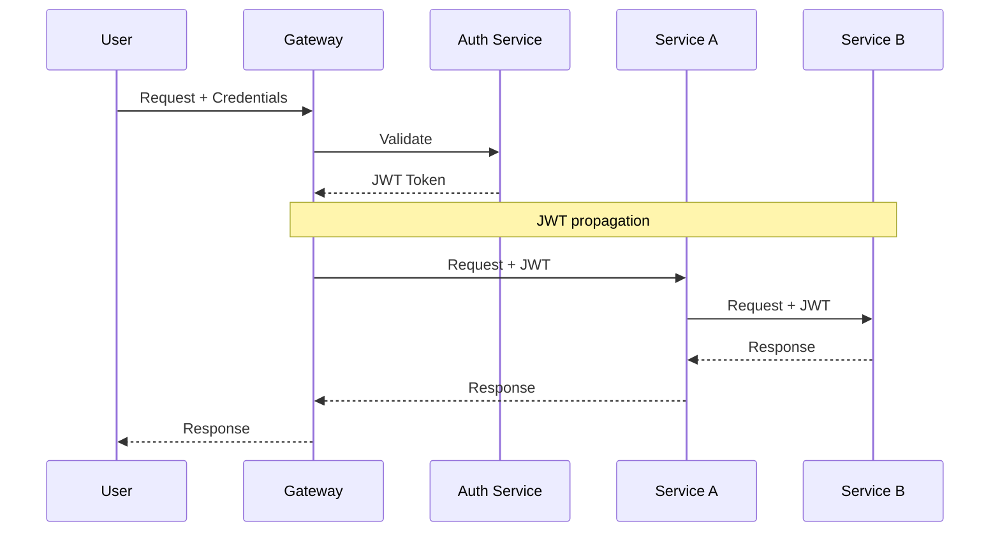
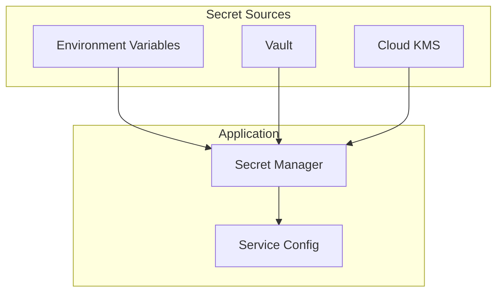
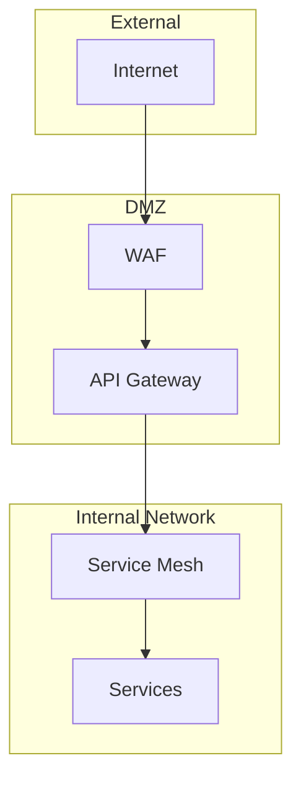
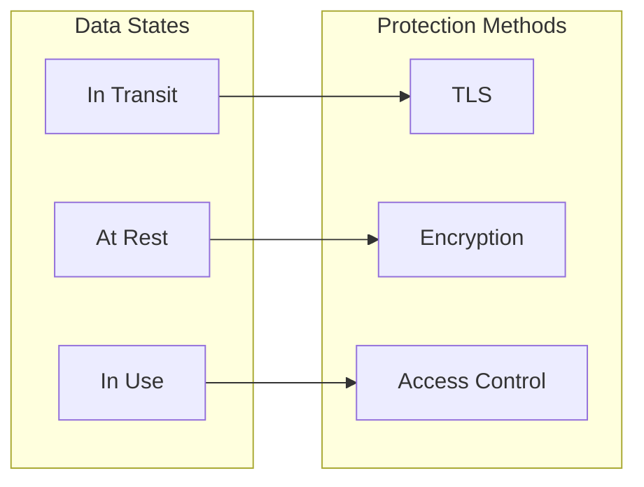
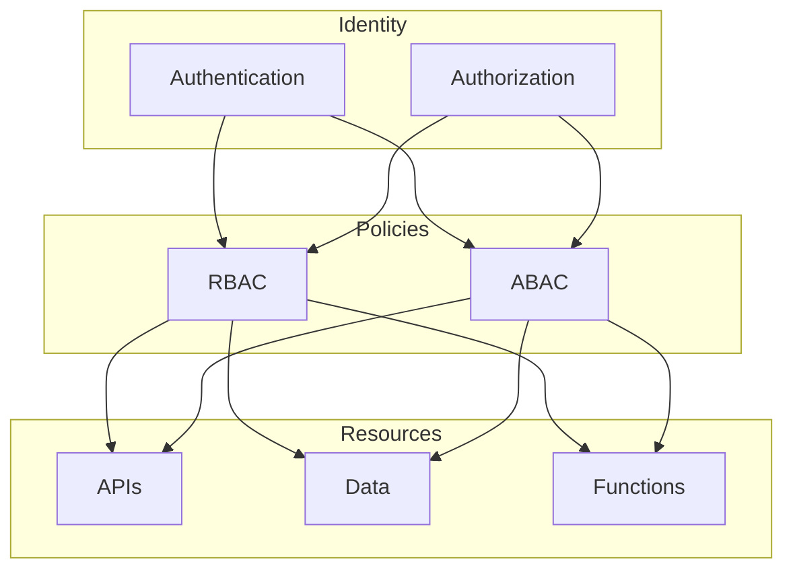
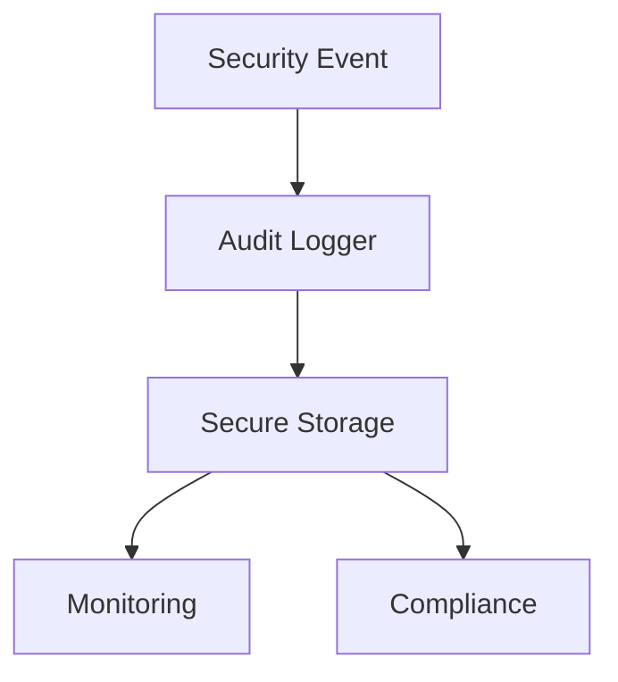
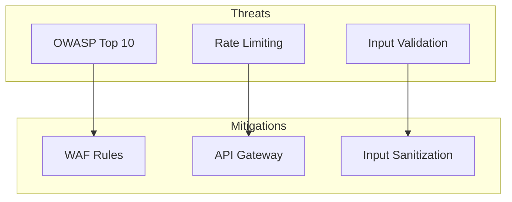
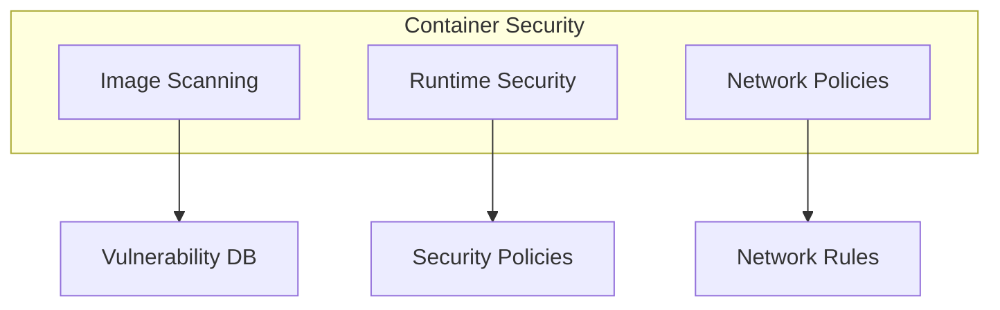

# Microservice Security Cookbook

## Core Security Patterns

### 1. Authentication & Authorization



**Recipe:**
```yaml
# Auth Service Configuration
security:
  jwt:
    secret: ${JWT_SECRET}
    expiration: 3600
    refresh-token-expiration: 86400
  cors:
    allowed-origins: "*"
    allowed-methods: ["GET", "POST", "PUT", "DELETE"]
```

### 2. Secret Management



**Recipe:**
```yaml
# Vault Configuration
vault:
  addr: "http://vault:8200"
  token: ${VAULT_TOKEN}
  paths:
    - secret/database
    - secret/api-keys
    - secret/certificates
```

### 3. Network Security



**Recipe:**
```yaml
# Network Policy
apiVersion: networking.k8s.io/v1
kind: NetworkPolicy
metadata:
  name: api-gateway
spec:
  podSelector:
    matchLabels:
      app: gateway
  ingress:
  - from:
    - podSelector:
        matchLabels:
          role: frontend
  egress:
  - to:
    - podSelector:
        matchLabels:
          role: backend
```

### 4. Data Protection



**Recipe:**
```yaml
# Encryption Configuration
encryption:
  algorithm: AES256
  key-rotation: 90d
  backup-retention: 30d
  
tls:
  version: "1.3"
  ciphers:
    - TLS_AES_128_GCM_SHA256
    - TLS_AES_256_GCM_SHA384
```

### 5. Access Control



**Recipe:**
```yaml
# RBAC Configuration
roles:
  admin:
    permissions:
      - "*"
  reader:
    permissions:
      - "read:*"
      - "list:*"
  writer:
    permissions:
      - "read:*"
      - "write:*"
      - "delete:own"
```

## Security Best Practices

### 1. Input Validation

```json
{
  "validation": {
    "input": {
      "sanitize": true,
      "escape": true,
      "max_length": 1000,
      "allowed_chars": "[a-zA-Z0-9-_.]"
    },
    "output": {
      "encode": true,
      "content_type": "application/json",
      "headers": {
        "X-Content-Type-Options": "nosniff",
        "X-Frame-Options": "DENY"
      }
    }
  }
}
```

### 2. Audit Logging



**Recipe:**
```yaml
# Audit Log Configuration
audit:
  enabled: true
  events:
    - authentication
    - authorization
    - data_access
    - configuration_change
  retention: 365d
  encryption: true
```

### 3. Security Headers

```yaml
# Security Headers Configuration
security_headers:
  Strict-Transport-Security: "max-age=31536000; includeSubDomains"
  Content-Security-Policy: "default-src 'self'"
  X-Content-Type-Options: "nosniff"
  X-Frame-Options: "DENY"
  X-XSS-Protection: "1; mode=block"
```

## Common Attack Vectors & Mitigations

### 1. API Security



**Recipe:**
```yaml
# API Security Configuration
api_security:
  rate_limit:
    window: 60s
    max_requests: 100
  throttling:
    enabled: true
    burst: 50
  validation:
    schema: true
    sanitize: true
```

### 2. Container Security



**Recipe:**
```yaml
# Container Security Policy
securityContext:
  runAsNonRoot: true
  runAsUser: 1000
  readOnlyRootFilesystem: true
  allowPrivilegeEscalation: false
capabilities:
  drop: ["ALL"]
```

Remember:
1. Defense in depth
2. Least privilege principle
3. Regular security audits
4. Automated security testing
5. Incident response plan
6. Security monitoring
7. Regular updates and patches