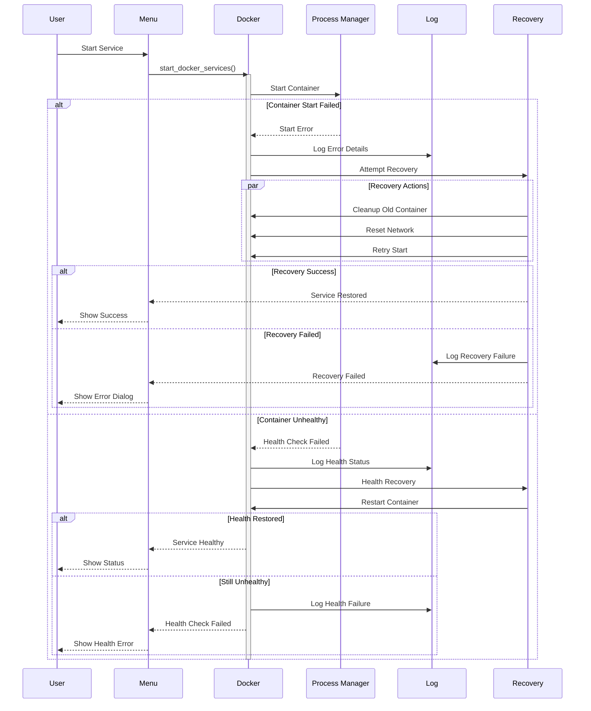
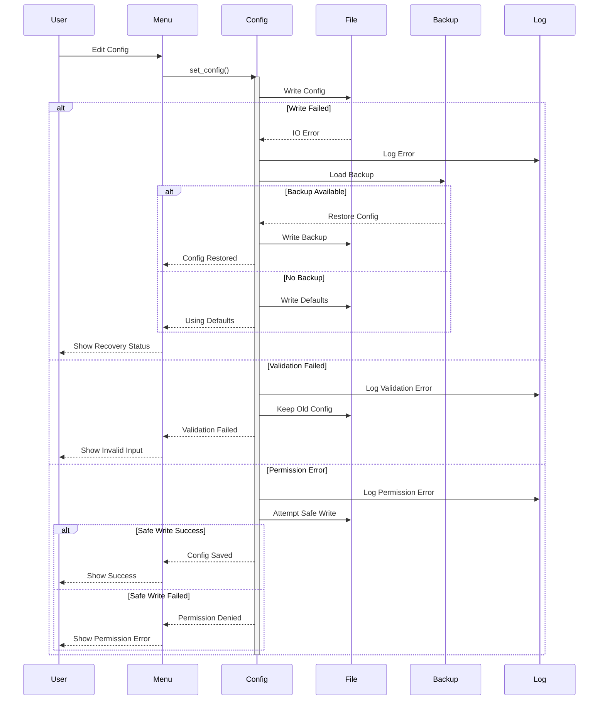
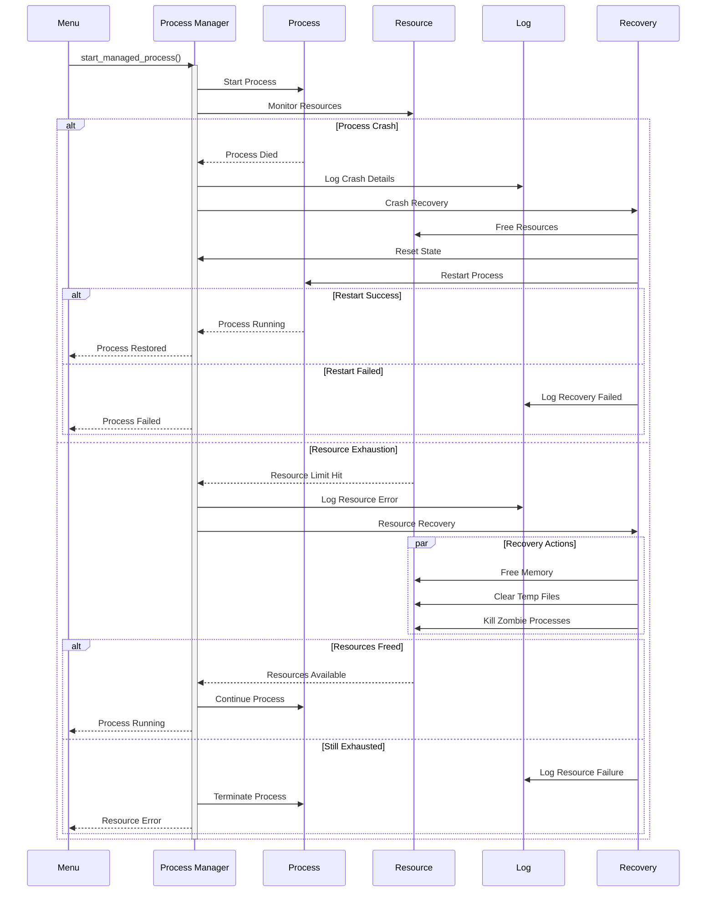
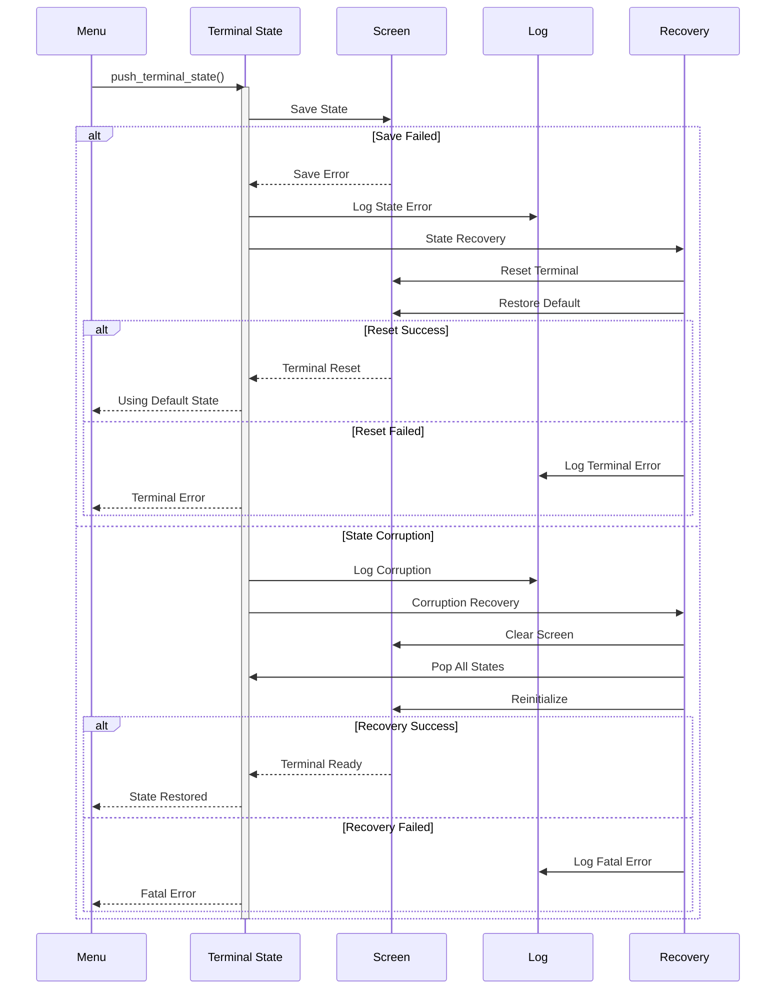
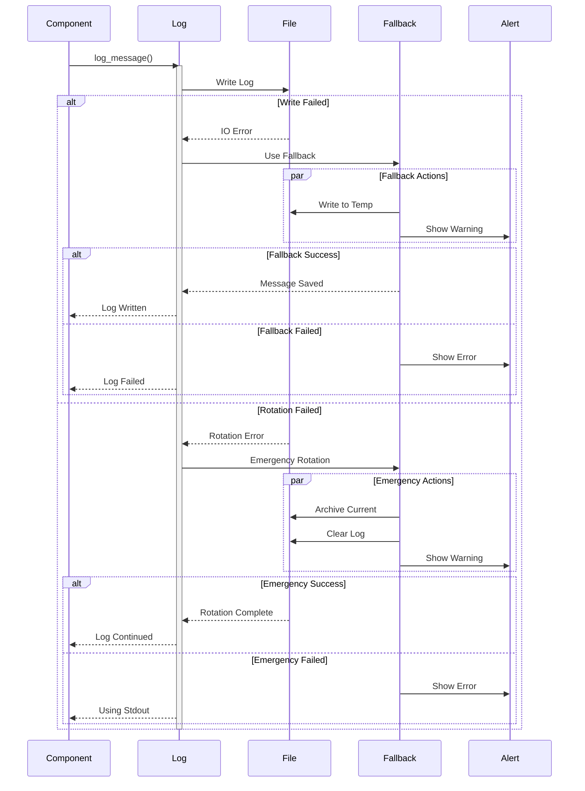
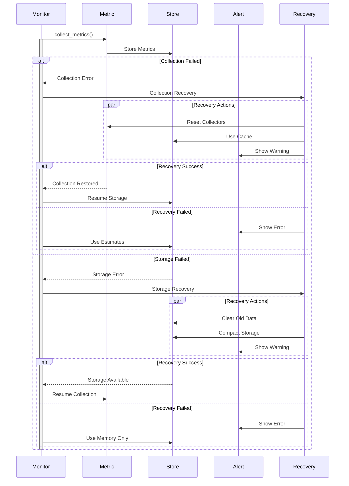

# Error Scenarios

This document details various error scenarios and their handling flows.

## Docker Service Failure



## Configuration Error Recovery



## Process Management Failure



## Terminal State Recovery



## Logging System Failure



## Resource Monitor Recovery



## Recovery Strategies

### Graceful Degradation
- Fall back to simpler UI if terminal state corrupts
- Use memory-only storage if disk fails
- Switch to stdout logging if log files are inaccessible
- Operate in reduced functionality mode when resources are constrained

### State Recovery
- Keep state checkpoints for critical operations
- Use transaction-like approaches for multi-step operations
- Maintain backup copies of configuration files
- Implement undo/redo capability for user actions

### Resource Management
- Implement garbage collection for orphaned processes
- Clear temporary files periodically
- Release unused terminal states
- Compact logs and metrics storage

### Service Recovery
- Implement exponential backoff for retries
- Use circuit breakers for failing services
- Maintain service health checks
- Implement automatic container cleanup

## Error Prevention Patterns

### Input Validation
```bash
validate_input() {
    local input=$1
    local type=$2
    
    case $type in
        "number")
            [[ $input =~ ^[0-9]+$ ]] || return 1
            ;;
        "path")
            [[ -e $input ]] || return 1
            ;;
        "container")
            docker inspect "$input" >/dev/null 2>&1 || return 1
            ;;
    esac
    return 0
}
```

### Resource Guards
```bash
with_resource_guard() {
    local resource=$1
    local operation=$2
    
    # Acquire
    lock_resource "$resource"
    
    # Execute with trap
    trap 'unlock_resource "$resource"' EXIT
    eval "$operation"
    
    # Release
    unlock_resource "$resource"
}
```

### State Invariants
```bash
check_state_invariants() {
    local component=$1
    
    # Check required files
    [[ -f "$CONFIG_FILE" ]] || return 1
    [[ -d "$LOG_DIR" ]] || return 1
    
    # Check permissions
    [[ -w "$LOG_DIR" ]] || return 1
    [[ -r "$CONFIG_FILE" ]] || return 1
    
    # Check running services
    pgrep -f "$component" >/dev/null || return 1
    
    return 0
}
```

## Error Handling Guidelines

### Core Principles
1. **Fail Fast** - Detect and handle errors early
2. **Fail Safe** - Always leave system in consistent state
3. **Recover Gracefully** - Provide degraded service over no service
4. **Inform Clearly** - Give users actionable error messages

### Implementation Rules
1. **Always check return values**
```bash
if ! some_operation; then
    log_error "Operation failed"
    handle_error
fi
```

2. **Use error codes consistently**
```bash
ERROR_CODES=(
    "E_CONFIG=1"
    "E_PERMISSION=2"
    "E_RESOURCE=3"
    "E_NETWORK=4"
)
```

3. **Implement proper cleanup**
```bash
cleanup() {
    remove_temp_files
    release_locks
    restore_terminal
}
trap cleanup EXIT
```

4. **Log errors with context**
```bash
log_error() {
    local msg=$1
    local context=$2
    echo "[ERROR] $(date '+%Y-%m-%d %H:%M:%S') - $msg (Context: $context)" >> "$LOG_FILE"
}
```

### Best Practices
1. Never swallow errors silently
2. Always provide recovery options
3. Keep error messages user-friendly
4. Maintain audit trail of errors
5. Test error scenarios regularly
6. Document recovery procedures

These diagrams show:
1. Detailed error paths
2. Recovery strategies
3. Fallback mechanisms
4. Resource cleanup
5. State restoration
6. User notification

Would you like me to:
1. Add more specific error scenarios
2. Detail recovery strategies
3. Add error prevention patterns
4. Create error handling guidelines 