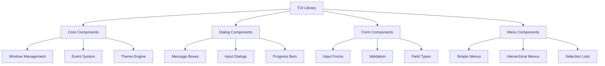

# Dev-Ops TUI Library

A powerful Terminal User Interface (TUI) library for DevOps tools, built in pure Bash.

## Features

!!! tip "Key Features"
    - 📦 Rich set of dialog components
    - 🔧 DevOps-focused utilities
    - 🎨 Customizable themes
    - 🧪 Comprehensive test suite
    - 📚 Extensive documentation

## Quick Start

=== "Ubuntu/Debian"
    ```bash
    # Install dependencies
    sudo apt-get install dialog
    
    # Clone the repository
    git clone https://github.com/elleshadow/dev-ops-tui.git
    
    # Run the demo
    cd dev-ops-tui
    ./demo/tui_demo.sh
    ```

=== "macOS"
    ```bash
    # Install dependencies
    brew install dialog
    
    # Clone the repository
    git clone https://github.com/elleshadow/dev-ops-tui.git
    
    # Run the demo
    cd dev-ops-tui
    ./demo/tui_demo.sh
    ```

=== "CentOS/RHEL"
    ```bash
    # Install dependencies
    sudo yum install dialog
    
    # Clone the repository
    git clone https://github.com/elleshadow/dev-ops-tui.git
    
    # Run the demo
    cd dev-ops-tui
    ./demo/tui_demo.sh
    ```

## Example Usage

Here's a simple example of creating a dialog:

```bash
#!/bin/bash
source "path/to/tui/components/dialog.sh"

# Create a simple message box
create_msgbox "Welcome" "Hello, World!"

# Create a yes/no dialog
if create_yesno "Question" "Would you like to continue?"; then
    echo "User selected Yes"
else
    echo "User selected No"
fi
```

## Component Architecture



## Project Status

| Component | Status | Description |
|-----------|--------|-------------|
| Core | ✅ Complete | Base functionality |
| Dialogs | ✅ Complete | All dialog types implemented |
| Forms | 🚧 In Progress | Basic forms working |
| Menus | 🚧 In Progress | Simple menus implemented |
| Themes | 📝 Planned | Theme system design |

## Getting Started

Check out our [Quick Start Guide](quickstart.md) to begin using the library, or dive into the [API Reference](api/core.md) for detailed documentation.

!!! note "Version Support"
    This library requires Bash 4.0 or later. See the [installation guide](installation.md) for detailed requirements.

!!! warning "Development Status"
    This project is under active development. APIs may change in future versions.

## Contributing

We welcome contributions! See our [Contributing Guide](contributing.md) for details.

## License

This project is licensed under the MIT License. See the [LICENSE](license.md) file for details. 