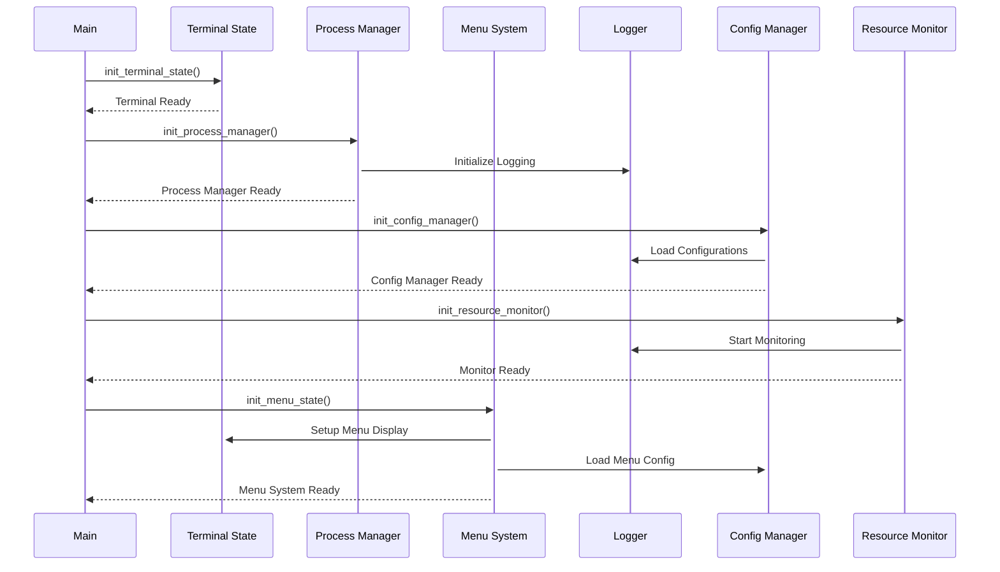
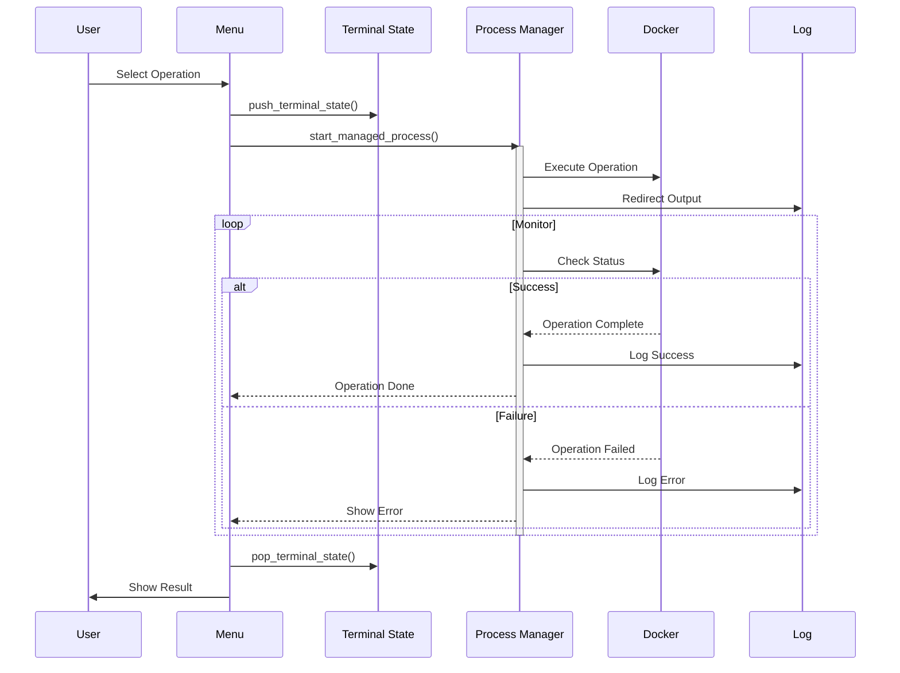
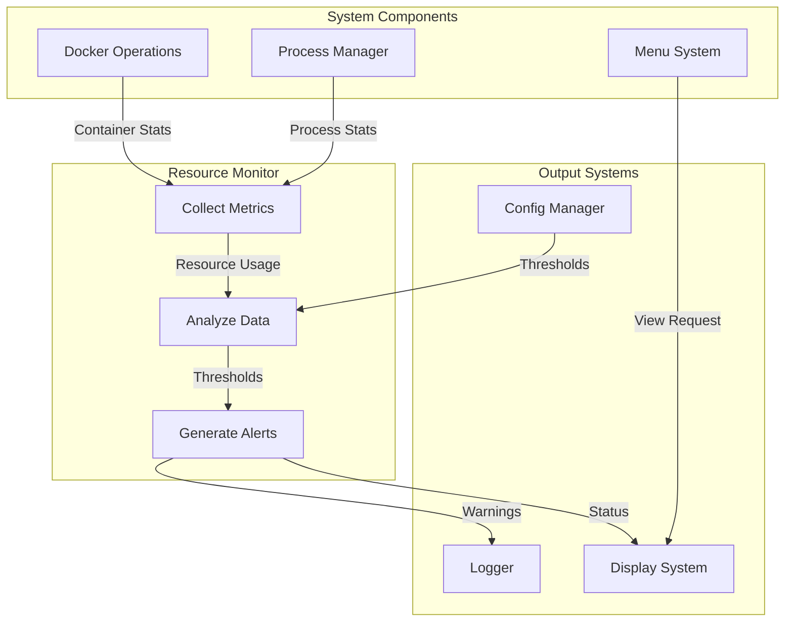
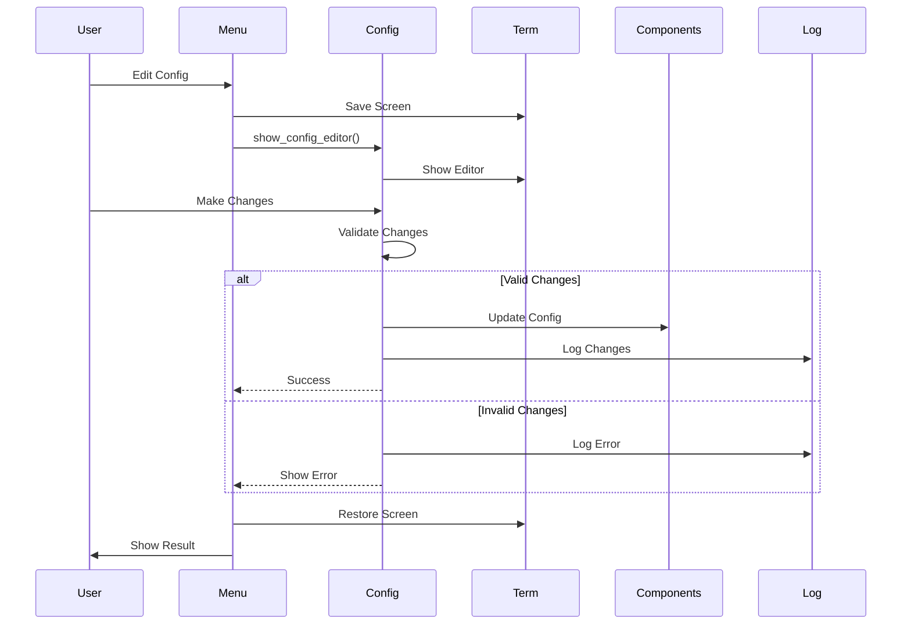
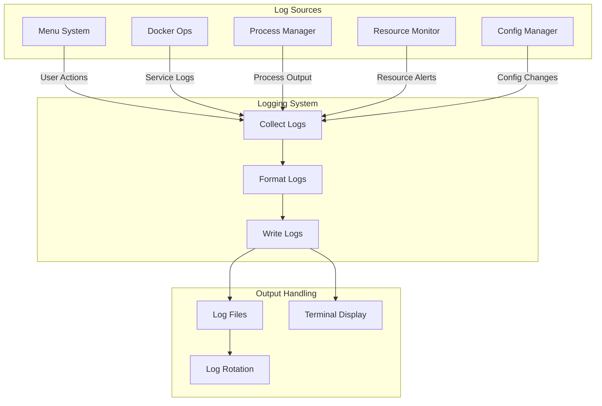
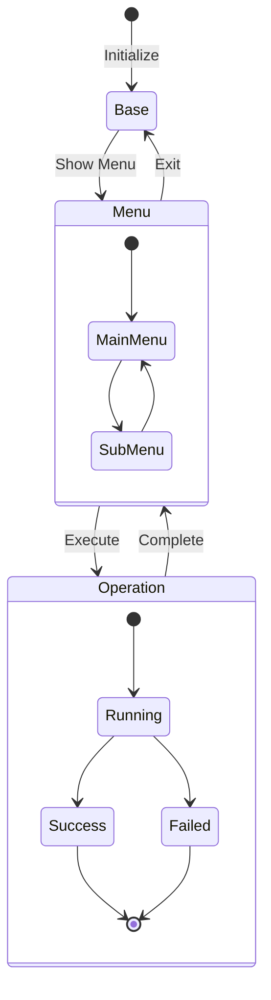
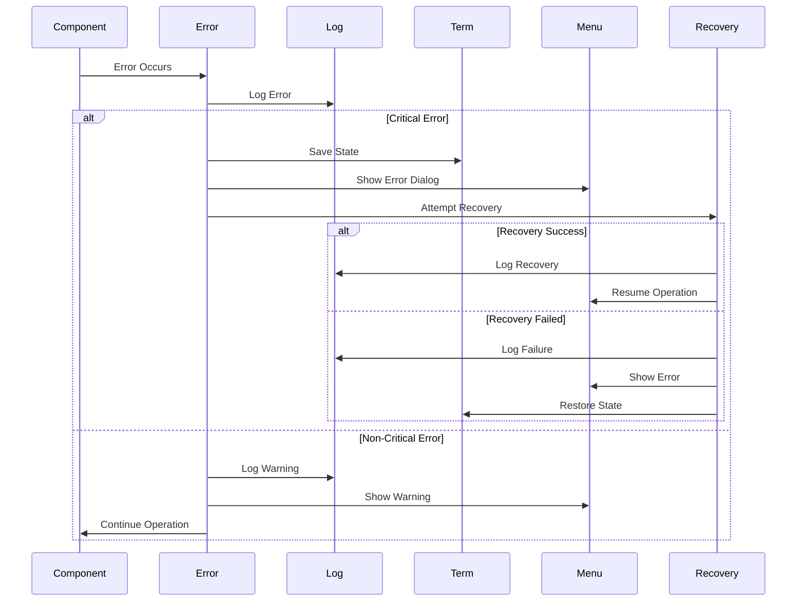
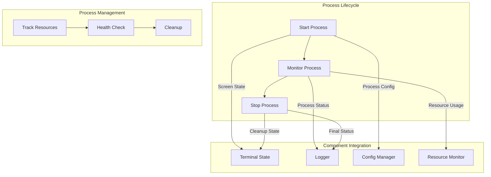

# Component Interactions

This document details how the various components of the system interact with each other.

## System Initialization Flow

## Operation Execution Flow

## Resource Monitoring Integration

## Configuration Management Flow

## Logging Integration

## Terminal State Management

## Error Handling Flow

## Process Lifecycle Integration

These diagrams show how the components work together to:
1. Initialize the system
2. Execute operations
3. Monitor resources
4. Manage configuration
5. Handle logging
6. Manage terminal state
7. Handle errors
8. Manage processes

Would you like me to:
1. Add more specific interaction diagrams
2. Detail any particular interaction flow
3. Add more component integration patterns
4. Create sequence diagrams for specific operations 