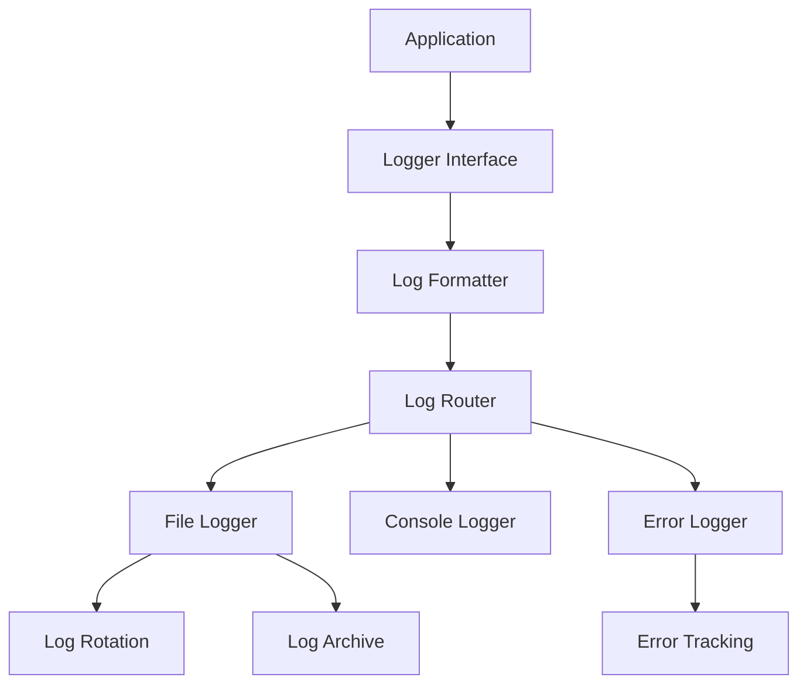
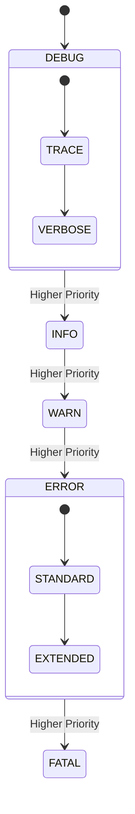

# Logging System

## Overview

The logging system provides comprehensive logging capabilities with:
- Multi-level logging
- Structured log formats
- Log rotation
- Error tracking
- Performance monitoring
- Audit trails

## Architecture



## Log Levels



## Components

### 1. Logger Interface

```bash
# Log at different levels
log_debug "Detailed debugging information"
log_info "General information"
log_warn "Warning messages"
log_error "Error conditions"
log_fatal "Fatal errors"

# Log with context
log_with_context "COMPONENT" "MESSAGE" "DETAILS"
```

### 2. Log Formatter

```bash
# Structured log format
[TIMESTAMP] [LEVEL] [COMPONENT] [CONTEXT] Message
Details: {...}
Stack: [...]
```

### 3. Log Router

```bash
# Route logs based on level and type
route_log() {
    local level=$1
    local message=$2
    
    case $level in
        "ERROR"|"FATAL")
            write_error_log "$message"
            notify_error_handlers "$message"
            ;;
        "WARN")
            write_warning_log "$message"
            ;;
        *)
            write_standard_log "$message"
            ;;
    esac
}
```

### 4. File Logger

```bash
# Write to log file with rotation
write_log() {
    local message=$1
    echo "$message" >> "$LOG_FILE"
    check_rotation_needed
}
```

### 5. Error Tracking

```bash
# Track error occurrences
track_error() {
    local error_id=$1
    local details=$2
    
    # Record error
    record_error "$error_id" "$details"
    
    # Check threshold
    if check_error_threshold "$error_id"; then
        trigger_error_alert "$error_id"
    fi
}
```

## Features

### 1. Log Rotation

```bash
# Rotation configuration
LOG_MAX_SIZE="100M"
LOG_KEEP_DAYS=30
LOG_COMPRESS=true

# Rotation logic
check_rotation_needed() {
    local size
    size=$(get_log_size)
    
    if ((size > LOG_MAX_SIZE)); then
        rotate_logs
    fi
}
```

### 2. Error Handling

```bash
# Error handling integration
handle_error() {
    local error=$1
    local context=$2
    
    # Log error
    log_error "$error"
    
    # Track occurrence
    track_error "$error" "$context"
    
    # Notify if needed
    if is_critical_error "$error"; then
        notify_admin "$error" "$context"
    fi
}
```

### 3. Performance Monitoring

```bash
# Performance logging
log_performance() {
    local operation=$1
    local duration=$2
    local details=$3
    
    log_with_context "PERFORMANCE" \
        "Operation: $operation, Duration: ${duration}ms" \
        "$details"
}
```

### 4. Audit Trail

```bash
# Audit logging
log_audit() {
    local user=$1
    local action=$2
    local details=$3
    
    log_with_context "AUDIT" \
        "User: $user, Action: $action" \
        "$details"
}
```

## Configuration

```bash
# Log levels
LOG_LEVEL_DEBUG=0
LOG_LEVEL_INFO=1
LOG_LEVEL_WARN=2
LOG_LEVEL_ERROR=3
LOG_LEVEL_FATAL=4

# File locations
LOG_DIR="/var/log/app"
LOG_FILE="$LOG_DIR/app.log"
ERROR_LOG="$LOG_DIR/error.log"
AUDIT_LOG="$LOG_DIR/audit.log"

# Rotation settings
LOG_ROTATE_SIZE="100M"
LOG_ROTATE_COUNT=5
LOG_COMPRESS=true

# Error tracking
ERROR_THRESHOLD=5
ERROR_WINDOW="5m"
```

## Usage Examples

### Basic Logging

```bash
# Initialize logging
init_logging

# Log at different levels
log_debug "Debug message"
log_info "Info message"
log_warn "Warning message"
log_error "Error message"
```

### Structured Logging

```bash
# Log with context
log_with_context "DOCKER" "Container started" \
    "{ \"container\": \"web\", \"status\": \"running\" }"

# Log performance
log_performance "database_query" 150 \
    "{ \"query\": \"SELECT\", \"rows\": 1000 }"

# Log audit
log_audit "admin" "config_change" \
    "{ \"setting\": \"log_level\", \"value\": \"debug\" }"
```

### Error Handling

```bash
# Handle errors with context
handle_error "Connection failed" \
    "{ \"service\": \"database\", \"attempt\": 3 }"

# Track error patterns
track_error "DB_CONN_FAIL" \
    "{ \"host\": \"db1\", \"time\": \"2023-01-01\" }"
```

## Best Practices

1. **Log Levels**
   - Use appropriate log levels
   - Include context in messages
   - Be consistent in formatting

2. **Performance**
   - Log rotation configuration
   - Buffer writes when possible
   - Monitor log size

3. **Security**
   - Sanitize sensitive data
   - Implement log access control
   - Regular log cleanup

4. **Maintenance**
   - Regular log analysis
   - Error pattern monitoring
   - Performance tracking

5. **Integration**
   - Consistent error handling
   - Proper context propagation
   - Structured data format 