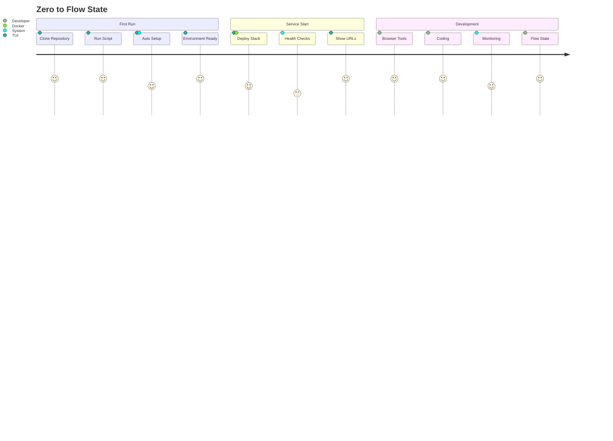
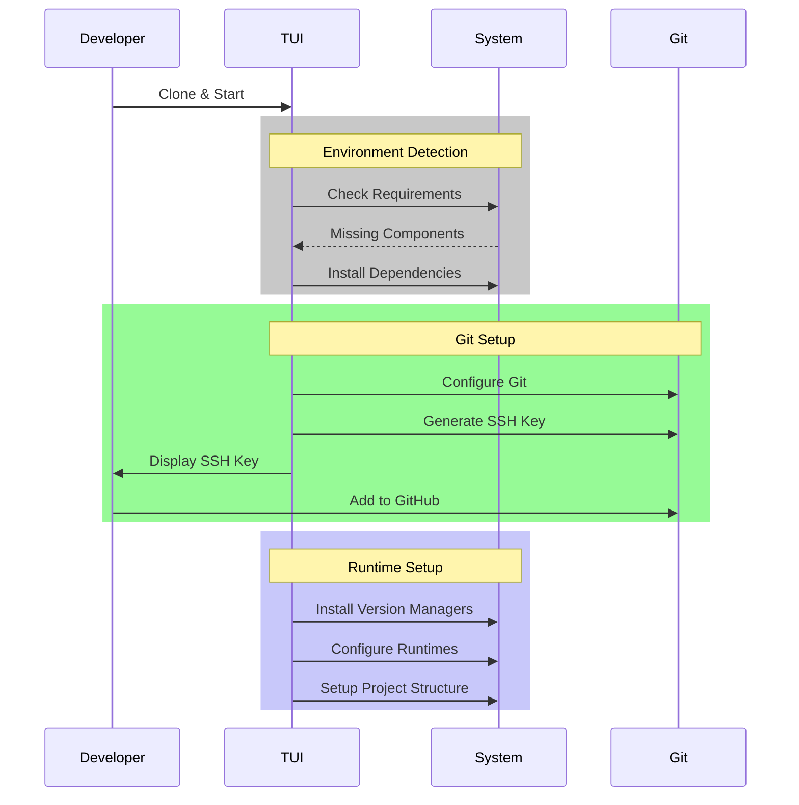
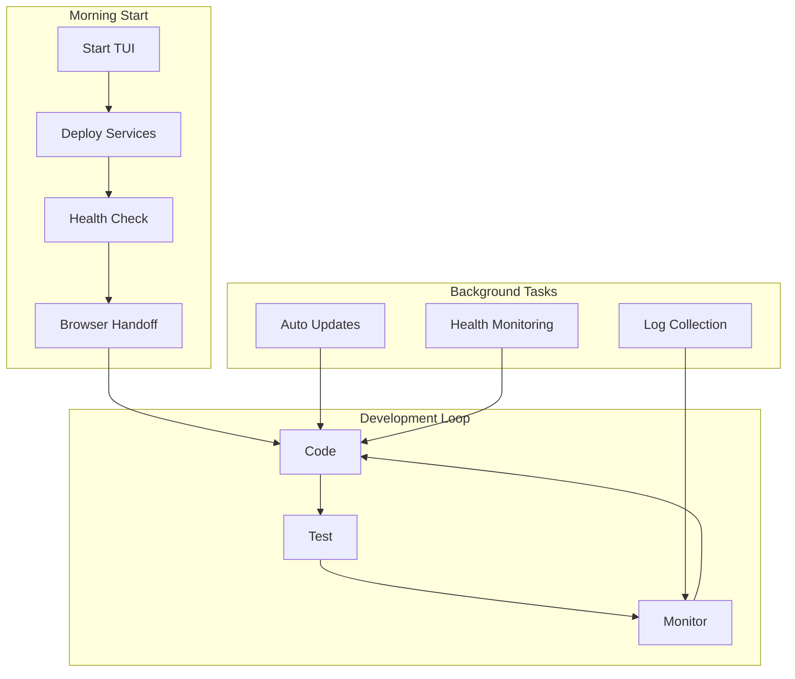
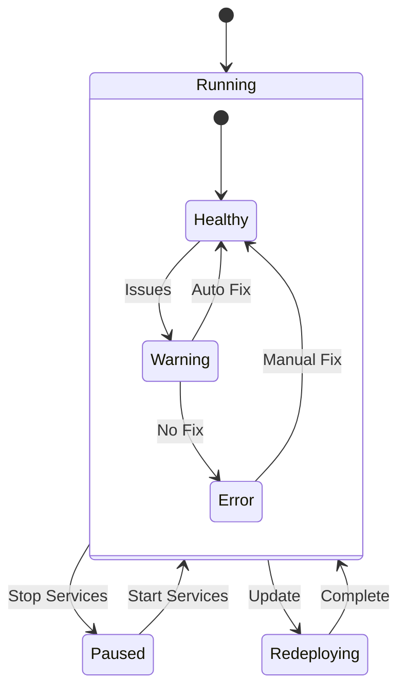
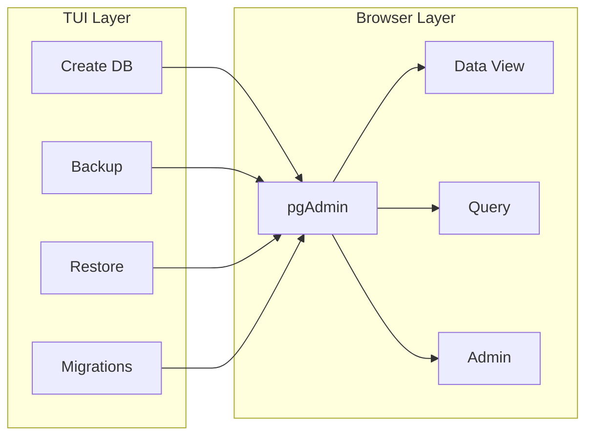
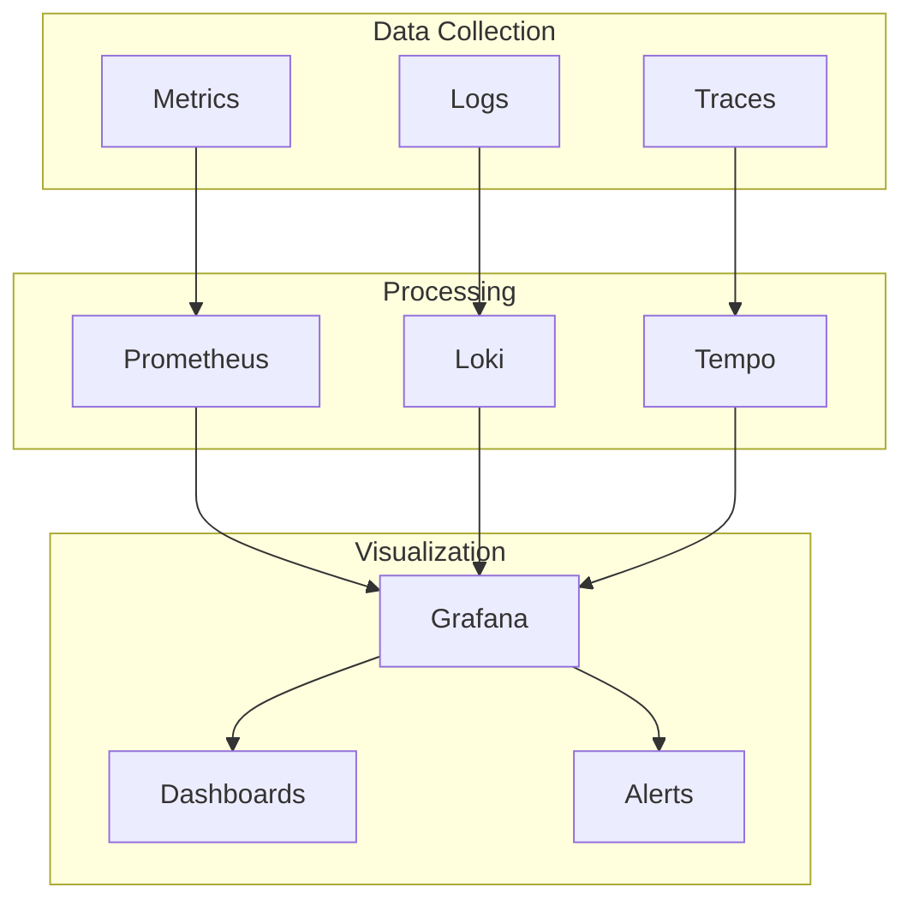
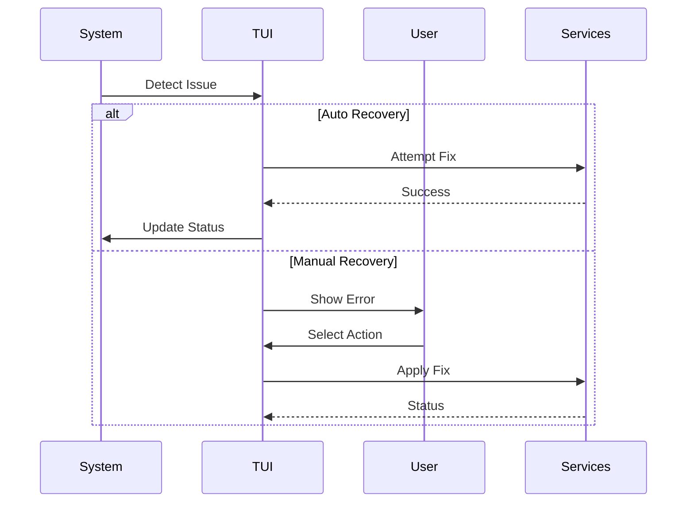
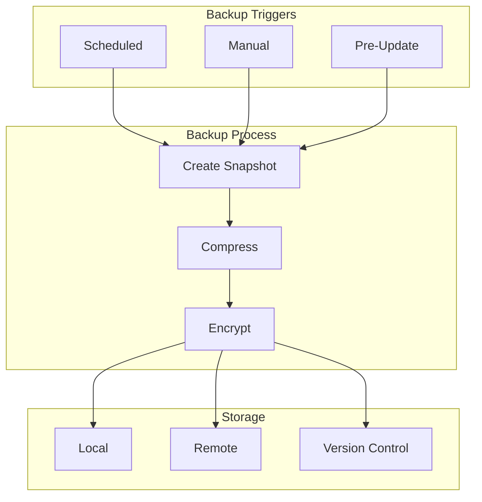
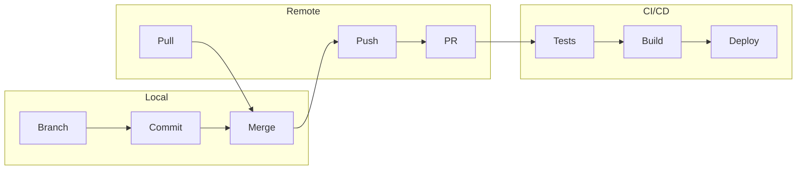
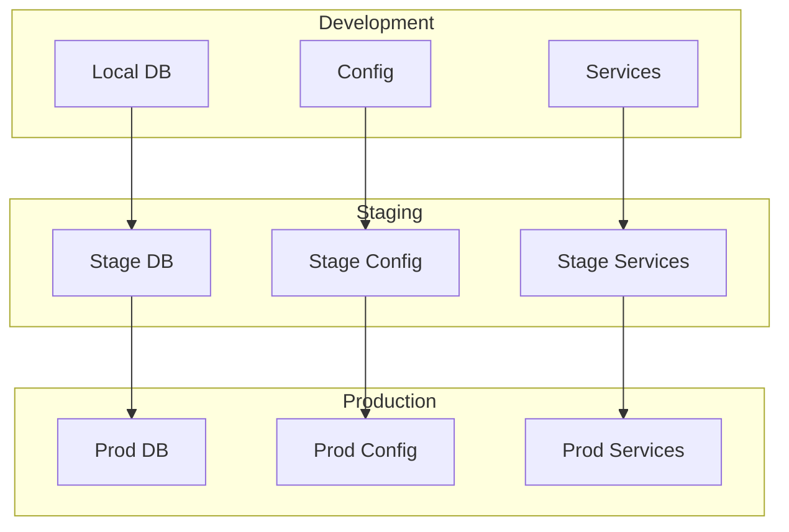

# Development Workflows

## Zero to Flow Journey

## Common Workflows

### 1. First Time Setup

### 2. Daily Development

### 3. Service Management

### 4. Database Operations

### 5. Monitoring Flow

## Error Handling Workflows

### 1. Service Recovery

### 2. Data Protection

## Integration Workflows

### 1. Git Operations

### 2. Environment Sync

Remember: These workflows are designed to maintain developer flow state. The TUI handles complexity and orchestration, then gets out of the way for actual development work. 